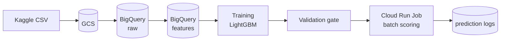
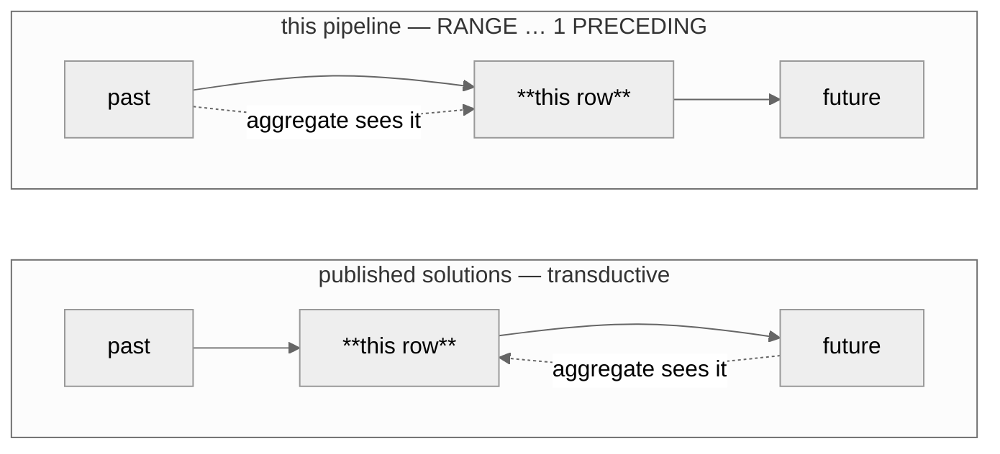
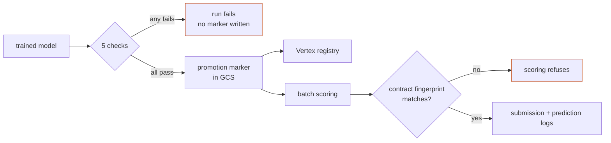

# A rig for trying approaches, and finding out whether they worked

A fraud-detection pipeline on Google Cloud, built as somewhere to try things: feature
engineering, orchestration patterns, and cloud-managed data and state — on a real,
awkward dataset rather than a toy one.

What makes it more than a sandbox is the second half of that sentence. **Every approach
has to survive the same machinery**: the same audits, the same feature contract, the same
promotion gate. And the noise floor was measured before any of them were tried, so "it
worked" has a bar to clear rather than a story to tell.

The first thing that discipline produced was uncomfortable and is the most useful result
here: **most of the candidate improvements turned out to be unmeasurable.** Not small —
unmeasurable, sitting inside the run-to-run spread of the pipeline itself.

Three genuinely different feature sets — 184, 225 and 224 columns, each the output of a
different admission policy — landed inside the spread of **one model refit five times with
nothing changed but the random seed**. The leaderboard agreed: the _worst_ of the three
locally scored _best_ publicly.

A rig that can tell you this is worth more than one that lets you believe otherwise.

## Negative results

The findings this project is most confident in are the ones that closed something down.

|                                                                   |                                                                                                                                                                                                                             |
| ----------------------------------------------------------------- | --------------------------------------------------------------------------------------------------------------------------------------------------------------------------------------------------------------------------- |
| **The noise floor is twice what was assumed**                     | `sd 0.0065` PR-AUC, not `~0.003`. Three earlier conclusions were retracted on it, including one recorded the same evening.                                                                                                  |
| **Two promotion-gate checks could not fail**                      | One compared against a floor of `0.0`; the other read a metric key training never wrote, and `dict.get(key, 0.0)` turned that into a pass. Both logged `PASS` on every run.                                                 |
| **A sixth audit was built and switched off the same day**         | It rejected 26 columns that scored well pooled and near-chance inside the dominant segment. Applying its verdicts cost **0.0325 PR-AUC** and moved that segment by 0.0005. The measurement was kept; the inference was not. |
| **The winning solutions' key feature does not survive causality** | Their aggregates are computed over train ∪ test. Recomputed point-in-time, the same idea is worth less than the noise floor.                                                                                                |
| **A calibrator won on log loss by destroying ranking**            | Isotonic beat Platt by 0.0007 log loss and collapsed 59,054 scores into 93 distinct values, costing 0.0211 PR-AUC in ties.                                                                                                  |

## What you can try in it

|                         |                                                                                                                                                                                                                         |
| ----------------------- | ----------------------------------------------------------------------------------------------------------------------------------------------------------------------------------------------------------------------- |
| **Feature engineering** | Declare a column, and six audits decide whether it reaches the model — time consistency, distribution shift, redundancy, entity purity, selection, within-segment signal. The verdicts merge into a committed contract. |
| **EDA**                 | Thirteen notebooks, each a distinct technique on the same data, importing the _same_ modules the pipeline runs — so an analysis cannot quietly measure a different implementation.                                      |
| **Orchestration**       | Three Dagster code locations, asset groups, checks, declarative automation, a custom IO manager, column-level lineage into the catalog. Laid out in [docs/orchestration.md](docs/orchestration.md).                     |
| **Cloud as the engine** | BigQuery does the compute and the frames never pass through the orchestrator; GCS holds artifacts and the promotion marker that _is_ the deployment state; Vertex holds experiments and the registry.                   |



---

## The three ideas worth reading the code for

**1. A feature contract, not a feature list.** Six audits judge every candidate column —
time consistency, distribution shift, redundancy, entity purity, selection, within-segment
signal — and their verdicts merge into one committed artefact,
[`references/feature-contract.json`](references/feature-contract.json). It records what was
admitted, what was rejected, by which check, with which number, and how far that check's
verdicts reproduce. A model is stamped with the contract's fingerprint at fit time, and the
scoring job **refuses to run** if the stamp and the contract on disk disagree.

**2. Point-in-time correctness, enforced rather than intended.**



Every velocity aggregate
uses a `RANGE … 1 PRECEDING` window frame, which excludes the current row and every row
sharing its timestamp. Positional functions (`LAG`, `ROWS` frames) are banned and asserted
absent by tests. The reasoning and the near-miss that produced the rule are in
[docs/point-in-time.md](docs/point-in-time.md).

**3. A promotion gate that fails the run.** Five checks. A model that regresses never
reaches the registry, and "it looked better" is not a judgement anyone makes at the end of
an afternoon.



The gate is not the only thing that can stop a bad model: the scoring path independently
refuses to run if the model's stamped contract fingerprint disagrees with the contract on
disk. Two different failures, two different places, neither reachable by accident.

The model is not evenly good, and a pooled metric hides it completely — `ProductCD == "W"`
is 77% of the traffic at a quarter of `R`'s PR-AUC. Finding that is what the fifth gate
check exists for.

## What the numbers can and cannot say

Before any result was reported, the run-to-run noise band was measured: refit the same
configuration five times with nothing moving but the random seed
([`uv run noise-band`](src/fraud_detection/cli/noise_band.py)). It came out at
**sd 0.0029 ROC-AUC**, which means a single training run resolves nothing below about 0.004
and a single leaderboard submission nothing below 0.005.

Several plausible-looking improvements then landed inside that band. They are recorded as
**unmeasured**, never as wins — a difference smaller than the noise is not a small effect,
it is the absence of a measurement.

### Three things the rig was then pointed at

| Question | Answer |
| --- | --- |
| What does refusing to look at the future cost? | **0.0169 ROC-AUC.** Same features, same model, one window frame swapped from `1 PRECEDING` to `UNBOUNDED FOLLOWING`. About a quarter of the distance to the published 0.96 — not most of it, as this README previously claimed. |
| Does the feature contract select on signal, or no better than chance? | **It selects.** At equal size, admitted beats a random draw by 0.0063 and beats a draw from the rejected columns by **0.0280** — fifteen times the resolution. |
| Does the policy override on nineteen columns earn its place? | **No.** −0.0002 ROC-AUC, a tenth of the resolution. The argument for it still looks right; it is not worth nineteen columns. |

Each is seed-averaged and reported against the noise floor above. Two of the three
contradicted what this project believed before it measured them.

Current numbers move whenever anything is rerun, so they live in the artifacts rather than
here: the promotion marker names the model in production, `metrics.json` beside it carries
what that model scored, and [docs/MEASUREMENTS.md](docs/MEASUREMENTS.md) records the ones
worth keeping.

## The three code locations, as Dagster renders them

Exported from a running instance, so these are the graphs the pipeline actually has rather
than a drawing of the graph it was meant to have. Layout and grouping are covered in
[docs/orchestration.md](docs/orchestration.md).

| Job | Description | Diagram |
| --- | ----------- | ------- |
| `feature_platform_job` | Raw CSV to a committed feature contract, with the audits that decide what the model may see. |  |
| `model_factory_job` | Splits, baseline, training, explainability, and the promotion gate that can stop all of it. |  |
| `inference_job` | The scoring path, run to completion by a Cloud Run Job. |  |

## Stack

| Layer                    | Choice                                                                           |
| ------------------------ | -------------------------------------------------------------------------------- |
| Orchestration            | Dagster — software-defined assets, three code locations                          |
| Warehouse and transforms | BigQuery SQL                                                                     |
| Training                 | LightGBM, scikit-learn                                                           |
| Tracking and registry    | Vertex AI Experiments and Model Registry                                         |
| Scoring                  | Cloud Run Job — a container that runs to completion and exits                    |
| IaC                      | OpenTofu                                                                         |
| CI/CD                    | GitHub Actions — lint, tests, image build and scan, SBOM, provenance attestation |

The split is deliberate: **data processing stays portable** (Dagster and SQL move anywhere),
**model operations are handed to managed services** (a self-hosted registry buys nothing).

## Quick start

```bash
uv venv && source .venv/bin/activate && uv sync
uv run ruff check . && uv run pytest
uv run dagster dev -w dagster/workspace.yaml -p 3000
```

Tests run against a committed sample CSV — no cloud access needed to verify the pipeline
works. Running it against the real dataset needs a GCP project; see
[docs/setup.md](docs/setup.md).

## Where to look

### Documents

| | |
| --- | --- |
| [DECISIONS.md](DECISIONS.md) | Every architectural decision, dated, with the evidence behind it — including the ones later reversed |
| [ATTRIBUTION.md](ATTRIBUTION.md) | Which findings came from published Kaggle work, what was taken, and what this repository does differently |
| [docs/architecture.md](docs/architecture.md) | Target architecture, module boundaries, what is deliberately out of scope |
| [docs/MEASUREMENTS.md](docs/MEASUREMENTS.md) | Every number, and how far each can be trusted |
| [docs/point-in-time.md](docs/point-in-time.md) | The leakage guarantee, in full |
| [docs/feature-engineering.md](docs/feature-engineering.md) | What each engineered feature is, and the entity it is computed over |
| [docs/model-card.md](docs/model-card.md) | Intended use, where the model is weakest, what would have to be true before it decided anything about a person |
| [docs/adversarial-drift.md](docs/adversarial-drift.md) | Why fraud drift is not weather, and what a system assuming an adapting opponent has to do differently |
| [docs/orchestration.md](docs/orchestration.md) | The Dagster layout — code locations, asset groups, jobs, checks, and which framework features are deliberately unused |
| [docs/code-structure.md](docs/code-structure.md) | Which code a notebook may import, and why the split is a deliberate decision |
| [docs/setup.md](docs/setup.md) | Local setup and runbook: auth, data staging, running each asset |
| [eda/README.md](eda/README.md) | 53 notebooks, one question each, indexed by theme |
| [src/fraud_detection/evaluation/README.md](src/fraud_detection/evaluation/README.md) | The six feature audits and what each one measures |
| [references/README.md](references/README.md) | Pinned artefacts: which are cited from elsewhere and which the pipeline produces |

### Repository

```text
config/                    admission policy, training and orchestration settings — the
                           thresholds live here with the reasoning beside them
dagster/                   workspace and instance configuration
docs/                      architecture, measurements, model card, orchestration
eda/notebooks/             53 analyses, each answering one question
iaac/                      infrastructure as code (OpenTofu)
references/                pinned artefacts: the feature contract, frequency maps, the
                           V-block column groups
src/fraud_detection/
    core/                  schema, feature contract, promotion marker, provenance, config
    evaluation/            the six feature audits — pure, notebook-importable
    feature_engineering/   SQL derivations, row-local features, scoring-history assembly
    training/              the modelling recipe — pure, notebook-importable
    orchestration/         Dagster assets, resources, catalog labels; may import anything,
                           nothing imports it
    serving/               /predict and /health, for the registry's container contract
    cli/                   score-batch, noise-band, build-frequency-maps
schemas/                   BigQuery schemas, shared by Python and Terraform
tests/                     unit tests, including the point-in-time and layering rules
```

Two structural rules, both enforced by tests rather than by convention:

- **`orchestration/` may import from anywhere; nothing may import from `orchestration/`.**
  That is what lets a notebook call the exact same training function the pipeline runs.
- **Nothing on the pure side may import Dagster or a cloud SDK.** A module that needs a
  BigQuery client is not notebook-importable and does not belong there.

## Scope

Raw data is not committed; the competition dataset needs a Kaggle account. Scoring is batch,
not online — the argument is in [docs/architecture.md](docs/architecture.md). This is a
demonstration system built on a public dataset: it has never scored a live payment, and
[docs/model-card.md](docs/model-card.md) states plainly what would have to change first.
