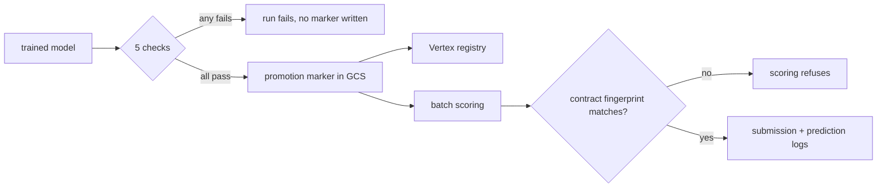
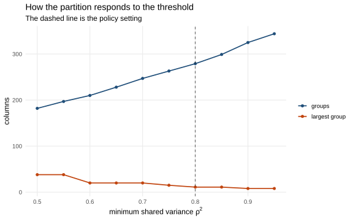
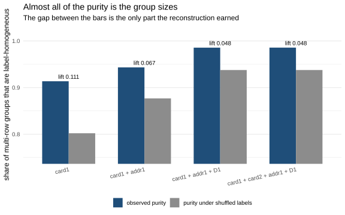

# IEEE-CIS fraud detection pipeline

Batch fraud scoring on the [IEEE-CIS](https://www.kaggle.com/c/ieee-fraud-detection) dataset,
running on Google Cloud. The analysis that decides which columns reach the model is R and
is stated as statistics; the model lifecycle is Python. BigQuery holds the data and
computes the features, Dagster orchestrates, LightGBM is the model, Vertex AI holds
experiments and the registry, and a Cloud Run Job does the scoring. Infrastructure is
OpenTofu, CI is GitHub Actions.

| If you came here for | Start at |
| --- | --- |
| The data and the modelling | [`analysis/`](analysis/README.md) — the R half: eight analyses, one question each, every verdict a statistic with an interval on it |
| The features themselves | [feature-engineering.md](docs/feature-engineering.md) for the twelve engineered features and their entities, [`references/`](references/README.md) for the pinned artefacts they are built against |
| The pipeline and its boundaries | [orchestration.md](docs/orchestration.md), including the three asset graphs as a running instance renders them, then [code-structure.md](docs/code-structure.md) |
| The cloud and the infrastructure | [google-cloud.md](docs/google-cloud.md) for the service choices, [`iaac/`](iaac/README.md) for the OpenTofu, [setup.md](docs/setup.md) for the runbook |
| Whether the results hold up | [MEASUREMENTS.md](docs/MEASUREMENTS.md) for the numbers, [DECISIONS.md](DECISIONS.md) for what was reversed |
| What was borrowed and what is original | [ATTRIBUTION.md](ATTRIBUTION.md) — every idea taken from published Kaggle work, and what this repository does differently with it |
| Risk and model governance | [model-card.md](docs/model-card.md), [point-in-time.md](docs/point-in-time.md), [adversarial-drift.md](docs/adversarial-drift.md) |

## What the pipeline enforces

**A feature contract.** Four audits write verdicts into
[`references/feature-contract.json`](references/feature-contract.json), each rejection
recorded with the check that made it and the number behind it. Training stamps the
contract's fingerprint onto the model; scoring compares it against the file on disk and
refuses to run on a mismatch.

**Rejections that are tests, not thresholds.** Every verdict needs two keys: statistical
significance after a Benjamini-Hochberg correction across the scan, and a stated effect
size. At 100,000 rows per window almost everything is significant -- 469 of 472 columns
move detectably -- so significance alone decides nothing, and the materiality threshold is
what does the discriminating.

**Point-in-time feature computation.** Every velocity aggregate uses a `RANGE ... 1 PRECEDING`
window frame; `LAG`, `LEAD` and `ROWS` frames are banned, and tests assert they never appear in
the generated SQL. Details, and the leak this caught: [docs/point-in-time.md](docs/point-in-time.md).

**A promotion gate.** Five checks run inside `validation_gate` and raise `Failure`, so a
regressed candidate fails the Dagster run instead of being annotated -- including a check on the
model's largest, weakest segment, because a pooled metric alone hides exactly that.



The numbers behind every claim above, and how far each can be trusted, are in
[docs/MEASUREMENTS.md](docs/MEASUREMENTS.md); what changed once they were measured is in
[DECISIONS.md](DECISIONS.md).

## The data

The dataset covers 590,540 e-commerce transactions, of which 3.5% are fraudulent
(Wilson 95% interval: [3.48%, 3.56%]). The time axis spans approximately six months.

<p align="center">
  
</p>

*Daily fraud rate with 95% Wilson confidence bands. The dashed line is the pooled rate.
The rate moves visibly across the period -- the structural break test (Bai-Perron) finds
two level shifts, neither of which falls where the audit windows are cut. Computed by
[why-the-validation-gap-is-not-a-mistake](analysis/notebooks/why-the-validation-gap-is-not-a-mistake.qmd).*

Both caveats about the time axis apply here. The windows are quantiles of the time value,
so they hold **equal numbers of rows and unequal amounts of calendar** -- 22.6 days early
against 35.1 days late -- and part of what reads as a feature changing is the later window
having watched for longer. The time column is never given to the joint two-sample test,
because the periods are defined by it and any discriminator handed that column scores a
perfect AUC without finding anything about the data.

The split: train ends at 0.75 of the time axis, validation runs 0.85-0.90, and the ten
percent between them is left unassigned because a chargeback arrives months after the
transaction it belongs to.

The fraud rate varies sharply by product: `W` carries most of the volume at a
below-average rate, while other products run several times the pooled rate. The Wilson
intervals do not overlap -- this is a real segmentation, not a sampling artefact, and it
is why the promotion gate judges the model on its *largest* segment rather than on a
pooled metric.

## The audits, as statistics

Every verdict is a test or an interval, not a threshold on a point estimate, and
nothing in the column is a model. Where a check rejects, it needs two keys:
significance after a Benjamini-Hochberg correction across the whole scan, and an
effect size above a stated threshold. At 100,000 rows per window the first is
nearly free -- 469 of 472 columns shift detectably -- so the second is what
actually decides.

| Question | Method | R |
| --- | --- | --- |
| Does a column carry signal at all? | Somers' D, identical to AUC on the Mann-Whitney scale | `Hmisc::somers2` |
| Did that signal change between an early and a late window? | DeLong's test for two AUCs, unpaired | `pROC::roc.test` |
| Did the column's distribution move? | PSI against its **measured** null, drawn from the multivariate hypergeometric | own |
| Is the move more than sampling noise? | Anderson-Darling and Cramer-von Mises, permutation p-values | `twosamples` |
| Which columns are *reconstructable* from the others? | Redundancy analysis on restricted cubic splines | `Hmisc::redun` |
| Are the two periods distinguishable **jointly**? | Energy two-sample test -- adversarial validation without the adversary | `energy::eqdist.etest` |

A few more statistics, the descriptive pass, and which of the three each one
can do to the contract -- reject, record, or nothing:
[`analysis/README.md`](analysis/README.md). One notebook per question, rendered
with Quarto; every one writes either a contract fragment or a table, and
`build-contract.qmd` merges the fragments without computing anything.

### What the audits found

**[Time consistency](analysis/notebooks/does-a-feature-still-mean-the-same-later.qmd).** A feature that
separates fraud one way early and the other way late has not found a weak signal -- it has
found a pattern that belongs to the past. The pipeline fits a WoE scorecard on the early
window and applies it unchanged to the late one, then plots the AUC of each against the
other, one point per column: the shaded quadrant, signal early and reversed late, is the
finding. `V150` is the clearest
case -- its two upper bins became empty in the later window and the WoE of the surviving bin
changed sign, from -0.30 to +0.49. The column did not merely weaken; its populated range
collapsed and the odds attached to what survived reversed.

<p align="center">
  
</p>

**[Distribution shift](analysis/notebooks/has-the-population-moved.qmd).** The same two
windows, asking about a column's own distribution rather than its relationship to the label.
Of 499 measurable columns every single one moves detectably and 200 move materially -- the
two-key rule visible inside one audit. It also separates two things a single index conflates:
`M7`, `M8` and `M9` post among the largest indices in the scan, and almost none of it is
about their values. Each went from 84% missing to 39% missing between the windows, and with
the empty bucket excluded their distributions are unchanged (0.0006 to 0.0047). A column
that *started being collected* looks exactly like a column that broke.

<p align="center">
  
</p>

**[Redundancy](analysis/notebooks/which-columns-say-the-same-thing-twice.qmd).** Correlation names a pair;
redundancy names the one to drop. Of the columns strongly correlated with a group-mate, only
a fraction are actually *reconstructable* from that group -- the rest correlate strongly and
still carry something nothing else does. The sensitivity of the partition to its own
threshold is checked below: it responds smoothly on both sides, so the policy setting is
not perched on a cliff edge. Horn's
parallel analysis adds the second angle -- across the pinned V-blocks the compression ratio
runs 4x to 11x, and `V143-V166` is eleven columns carrying one component with 94% of the
variance, so keeping one representative per block is far less lossy than it looked.

<p align="center">
  
</p>

**[Segment qualification](analysis/notebooks/does-a-column-work-inside-every-segment.qmd).** A column can
separate fraud across the whole table and separate nothing inside every product segment --
in which case it predicts *which segment a row is in*, not fraud. Several columns reach
pooled AUC as high as 0.70 and are constants inside the segment carrying most of the
traffic. The fragment records this without rejecting: applying the verdicts cost 0.0325
PR-AUC while moving the protected segment by 0.0005.

<p align="center">
  
</p>

**[Entity reconstruction](analysis/notebooks/who-is-the-customer-when-the-data-does-not-say.qmd).** The
dataset names no customer, and everything downstream needs one. Purity alone says nothing at
a 3.5% base rate -- a group of two rows is homogeneous 93% of the time by chance -- so the
lift over a permuted null is what is measured. It runs the other way from raw purity: each
component added buys less than the one before, because each also shatters groups into
singletons. Adding `card2` buys nothing (lift 0.0403 against 0.0405) while costing coverage.
Roughly half the table has no usable history at prediction time, so the gate's cold-entity
check is not an edge case -- it is most of the traffic.

<p align="center">
  
</p>

**[Forensic checks](analysis/notebooks/what-the-fraud-literature-asks-that-the-columns-do-not.qmd).** Five
classical tests that no per-column scan reaches. None feeds the contract; all describe what
is being modelled. The amounts are *close* to Benford --
[the leading-digit plot](docs/img/benford-plot.svg) shows the chi-square rejecting conformity
overwhelmingly while the effect size stays marginal, which is what 20,000 observations do to
a p-value. [Bai-Perron](docs/img/bai-perron-breakpoints.svg) finds two level shifts in the
daily rate, neither where the audit windows are cut, so a drift monitor pinned to that
convention would report late. And
[fraud rate by hour](docs/img/circular-fraud-rate.svg), plotted on the circle rather than the
line, shows a cycle Rayleigh rejects uniformity against strongly -- but `TransactionDT` is
seconds from an unpublished origin, so the cycle can be modelled and the hour cannot be named.

## The Dagster asset graphs

Three code locations, three graphs. These are rendered by a running instance.

| Graph | What it builds |
| --- | --- |
| `feature_platform_job` | Ingestion -> BigQuery tables -> feature SQL -> audit frame |
| `model_factory_job` | Training run -> validation gate -> promotion marker -> Vertex registry |
| `inference_job` | Promotion marker -> scoring run -> submission + prediction logs |

## Stack

| Layer | Choice |
| --- | --- |
| Feature audits | R: `targets` graph, Quarto reports, `testthat`, `renv` lockfile |
| Orchestration | Dagster, software-defined assets, three code locations |
| Warehouse and transforms | BigQuery SQL |
| Training | LightGBM, scikit-learn |
| Tracking and registry | Vertex AI Experiments and Model Registry |
| Scoring | Cloud Run Job |
| IaC | OpenTofu |
| CI/CD | GitHub Actions, two jobs: Python (lint, tests, contract freshness, `tofu validate`, Dagster definition checks, image build and vulnerability scan) and R (`renv::restore()`, `testthat`, audit-graph validation). The dispatched push workflow attaches an SBOM and SLSA provenance |

Data processing stays portable, since Dagster and SQL run anywhere. The model lifecycle is
handed to managed services, because self-hosting a registry and its backups would not change
anything about the result.

## Quick start

```bash
uv venv && source .venv/bin/activate && uv sync
uv run ruff check . && uv run pytest
uv run dagster dev -w dagster/workspace.yaml -p 3000
```

The audits and the contract:

```bash
cd analysis && Rscript -e 'renv::restore()' && cd ..       # once: the pinned R library

uv run export-audit-frame                                  # the frame the model sees
cd analysis && Rscript -e 'targets::tar_make()' && quarto render
uv run stamp-contract                                      # the only thing that crosses back
```

The test suite needs no cloud access. One ingestion test reads a local sample at
`data/raw/train_transaction_sample.csv`, which is not committed because the competition terms
do not allow redistributing the data; create it from your own Kaggle download first. Running
the pipeline against the full dataset needs a GCP project, see [docs/setup.md](docs/setup.md).

## Repository layout

```text
analysis/              the R half: the audits, the notebooks, the fragments they write
config/                admission policy, training and orchestration settings
dagster/               workspace and instance configuration
iaac/                  infrastructure as code (OpenTofu)
references/            feature contract, frequency maps, V-block column groups
schemas/               BigQuery schemas, read by both Python and OpenTofu
src/fraud_detection/   the Python half: the model lifecycle
tests/                 unit tests, including the point-in-time and layering rules
```

**The two halves.** `analysis/` decides what is true of the data and is R; `src/` decides
what is done with a model and is Python. Nothing crosses but the stamped contract -- no
Python in `analysis/`, no R in `src/`, and one JSON file between them.

**Inside the Python half**, every directory answers to exactly one box in the usual MLOps
vocabulary, and [code-structure.md](docs/code-structure.md) gives the mapping. A directory
answering to two is one whose name cannot tell you what belongs in it.

One import rule, checked by [`tests/test_layering.py`](tests/test_layering.py): `config`,
`schema`, `contract`, `features`, `training` and `registry` are the **pure layer** and may
not import Dagster or a cloud SDK; `tools`, `serving` and `orchestration` may, and nothing
in the pure layer may import them. That rule is what lets an analysis call the same
training function the pipeline runs.

## Scope

Raw data is not committed; the dataset requires a Kaggle account. Scoring is batch rather than
online, for the reasons in [docs/architecture.md](docs/architecture.md). This is a
demonstration system on a public dataset. It has never scored a live payment, and
[docs/model-card.md](docs/model-card.md) lists what would have to change before it could.
