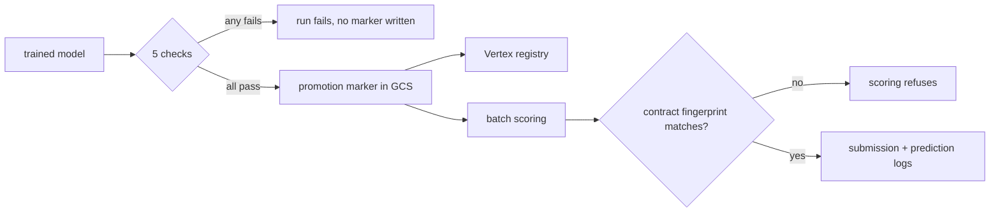

# IEEE-CIS fraud detection pipeline

Batch fraud scoring on the [IEEE-CIS](https://www.kaggle.com/c/ieee-fraud-detection) dataset,
running on Google Cloud. BigQuery holds the data and computes the features, Dagster
orchestrates, LightGBM is the model, Vertex AI holds experiments and the registry, and a
Cloud Run Job does the scoring. Infrastructure is OpenTofu, CI is GitHub Actions.

| If you came here for | Start at |
| --- | --- |
| The data and the modelling | [`eda/`](eda/README.md), 51 notebooks with one question each, then [the six audits](src/fraud_detection/evaluation/README.md) |
| The pipeline and its boundaries | [orchestration.md](docs/orchestration.md), then [code-structure.md](docs/code-structure.md) |
| The infrastructure | [`iaac/`](iaac/README.md) for the OpenTofu, [setup.md](docs/setup.md) for the runbook, `.github/workflows/` for CI |
| Whether the results hold up | [MEASUREMENTS.md](docs/MEASUREMENTS.md) for the numbers, [DECISIONS.md](DECISIONS.md) for what was reversed |
| Risk and model governance | [model-card.md](docs/model-card.md), [point-in-time.md](docs/point-in-time.md), [adversarial-drift.md](docs/adversarial-drift.md) |

## Resolution first

The run-to-run spread was measured before any result was reported: five refits of one
configuration with nothing changed but the LightGBM seed
([`uv run noise-band`](src/fraud_detection/cli/noise_band.py)).

| | sd | difference between two single fits |
| --- | ---: | ---: |
| ROC-AUC | 0.0029 | 0.0041 |
| PR-AUC | 0.0065 | 0.0092 |

Differences below that are recorded as unmeasured rather than as small effects. Several
changes that looked like improvements fell inside the band, including three feature sets of
184, 225 and 224 columns produced by three different admission policies. Their local scores
spanned 0.0017 ROC-AUC, and the lowest of the three scored highest on the public leaderboard.

The dominant source of that spread is early stopping rather than the model: `best_iteration`
ranged over 431–1581 across the five seeds.

## What the pipeline enforces

**A feature contract.** Six audits are implemented; four of them write verdicts into
[`references/feature-contract.json`](references/feature-contract.json), which currently admits
205 of 502 declared columns. The file records each rejection with the check that made
it and the number behind it, and carries a fingerprint over the admitted set. Training stamps
that fingerprint onto the model; the scoring job compares the stamp against the file on disk
and fails on a mismatch.

**Point-in-time feature computation.** Every velocity aggregate uses a `RANGE … 1 PRECEDING`
window frame, which excludes the current row and any row sharing its timestamp. `LAG`, `LEAD`
and `ROWS` frames are banned, tests assert they do not appear in the generated SQL, and the
materialized table is checked for pairs of counts that have to agree if the frames mean what
they claim. Details in [docs/point-in-time.md](docs/point-in-time.md).

**A promotion gate.** Five checks run inside `validation_gate` and raise `Failure`, so a
regressed candidate fails the Dagster run instead of being annotated: PR-AUC against the BQML
baseline, no regression on unseen clients, calibration error, false-positive rate carried out
of sample, and lift on the largest `ProductCD` segment. The last one exists because the model
is uneven and a pooled metric hides it: segment `W` is 77% of scored rows at roughly a
quarter of segment `R`'s PR-AUC.



## Results

Each of these is seed-averaged and reported against the band above.

| Question | Answer |
| --- | --- |
| What does point-in-time correctness cost? | 0.0169 ROC-AUC. One window frame swapped from `1 PRECEDING` to `UNBOUNDED FOLLOWING`, everything else held. That is about a third of the distance to the winning solutions' 0.945, not most of it. |
| Does the contract select on signal? | Yes. At equal size, the admitted set beats a random draw by 0.0063 and a draw from the rejected columns by 0.0280. |
| Was the policy override on nineteen columns worth keeping? | No. −0.0002 ROC-AUC, a tenth of the resolution. It has been retired. |

## What the measurements changed

| Finding | Consequence |
| --- | --- |
| The noise floor is `sd 0.0065` PR-AUC, not the `~0.003` previously assumed | Three earlier conclusions were retracted |
| Two gate checks could not fail: one compared against a floor of `0.0`, the other read a metric key training never wrote, where `dict.get(key, 0.0)` turned a missing value into a pass | Both rewritten; the gate is now the five checks above |
| `seconds_since_prev_txn_card` used `LAG`, so 166 rows saw a transaction at their own timestamp | Positional functions banned; the check moved from the generated SQL to the materialized table |
| A sixth audit rejected 26 columns that score well pooled and near-chance inside the dominant segment; applying its verdicts cost 0.0325 PR-AUC and moved that segment by 0.0005 | The audit reports rather than rejects |
| Isotonic calibration beat Platt by 0.0007 log loss while collapsing 59,054 scores into 93 distinct values, costing 0.0211 PR-AUC | Submissions carry raw scores, decisions carry calibrated ones |

Full workings, including the ones later reversed, are in
[docs/MEASUREMENTS.md](docs/MEASUREMENTS.md) and [DECISIONS.md](DECISIONS.md).

## The three code locations

Exported from a running Dagster instance. Layout and grouping are described in
[docs/orchestration.md](docs/orchestration.md).

| Job | Scope | Graph |
| --- | --- | --- |
| `feature_platform_job` | Raw CSV to a committed feature contract, with the audits behind it |  |
| `model_factory_job` | Splits, baseline, training, explainability, promotion gate |  |
| `inference_job` | The scoring path, run to completion by a Cloud Run Job |  |

## Stack

| Layer | Choice |
| --- | --- |
| Orchestration | Dagster, software-defined assets, three code locations |
| Warehouse and transforms | BigQuery SQL |
| Training | LightGBM, scikit-learn |
| Tracking and registry | Vertex AI Experiments and Model Registry |
| Scoring | Cloud Run Job |
| IaC | OpenTofu |
| CI/CD | GitHub Actions: lint, tests, image build and scan, SBOM, provenance attestation |

Data processing stays portable, since Dagster and SQL run anywhere. The model lifecycle is
handed to managed services, because self-hosting a registry and its backups would not change
anything about the result.

## Quick start

```bash
uv venv && source .venv/bin/activate && uv sync
uv run ruff check . && uv run pytest
uv run dagster dev -w dagster/workspace.yaml -p 3000
```

The test suite needs no cloud access. One ingestion test reads a local sample at
`data/raw/train_transaction_sample.csv`, which is not committed because the competition terms
do not allow redistributing the data; create it from your own Kaggle download first. Running
the pipeline against the full dataset needs a GCP project, see [docs/setup.md](docs/setup.md).

## Every document

| | |
| --- | --- |
| [DECISIONS.md](DECISIONS.md) | Architectural decisions, dated, with the evidence behind each |
| [ATTRIBUTION.md](ATTRIBUTION.md) | What came from published Kaggle work and what this repository does differently |
| [docs/architecture.md](docs/architecture.md) | Modules, boundaries, and what is out of scope |
| [docs/MEASUREMENTS.md](docs/MEASUREMENTS.md) | Every number and how far it can be trusted |
| [docs/point-in-time.md](docs/point-in-time.md) | The leakage guarantee and its enforcement |
| [docs/feature-engineering.md](docs/feature-engineering.md) | The twelve engineered features and their entities |
| [docs/model-card.md](docs/model-card.md) | Intended use, weaknesses, preconditions for real deployment |
| [docs/adversarial-drift.md](docs/adversarial-drift.md) | What changes when the distribution has an author |
| [docs/orchestration.md](docs/orchestration.md) | Code locations, groups, jobs, checks, unused Dagster features |
| [docs/code-structure.md](docs/code-structure.md) | Import rules and the tests that enforce them |
| [docs/setup.md](docs/setup.md) | Local setup and runbook |
| [eda/README.md](eda/README.md) | 51 notebooks, one question each |
| [src/fraud_detection/evaluation/README.md](src/fraud_detection/evaluation/README.md) | The six audits and what each measures |
| [references/README.md](references/README.md) | Pinned artefacts |

## Repository layout

```text
config/                    admission policy, training and orchestration settings
dagster/                   workspace and instance configuration
eda/notebooks/             51 analyses, one question each
iaac/                      infrastructure as code (OpenTofu)
references/                feature contract, frequency maps, V-block column groups
schemas/                   BigQuery schemas, read by both Python and OpenTofu
src/fraud_detection/
    core/                  schema, feature contract, promotion marker, provenance, config
    evaluation/            the six feature audits, importable from a notebook
    feature_engineering/   SQL derivations, row-local features, scoring-history assembly
    training/              the modelling recipe, importable from a notebook
    orchestration/         Dagster assets, resources, catalog labels
    serving/               /predict and /health, for the registry's container contract
    cli/                   score-batch, noise-band, build-frequency-maps
tests/                     unit tests, including the point-in-time and layering rules
```

Two import rules, checked by [`tests/test_layering.py`](tests/test_layering.py):
`orchestration/` may import from anywhere and nothing may import from it, and nothing outside
it may import Dagster or a cloud SDK. Together they are what lets a notebook call the same
training function the pipeline runs.

## Scope

Raw data is not committed; the dataset requires a Kaggle account. Scoring is batch rather than
online, for the reasons in [docs/architecture.md](docs/architecture.md). This is a
demonstration system on a public dataset. It has never scored a live payment, and
[docs/model-card.md](docs/model-card.md) lists what would have to change before it could.
