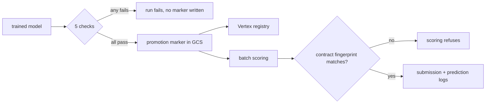

# IEEE-CIS fraud detection pipeline

Batch fraud scoring on the [IEEE-CIS](https://www.kaggle.com/c/ieee-fraud-detection) dataset,
running on Google Cloud. BigQuery holds the data and computes the features, Dagster
orchestrates, LightGBM is the model, Vertex AI holds experiments and the registry, and a
Cloud Run Job does the scoring. Infrastructure is OpenTofu, CI is GitHub Actions.

Which columns the model is allowed to see is not decided here. It arrives as a feature
contract from [`ieee-cis-fraud-detection-eda`](https://github.com/jjabuk/ieee-cis-fraud-detection-eda), and this repository executes it.

| If you came here for | Start at |
| --- | --- |
| Where the feature contract comes from | [`ieee-cis-fraud-detection-eda`](https://github.com/jjabuk/ieee-cis-fraud-detection-eda) — a separate repository, in R, which decides what is true of the data |
| The features themselves | [feature-engineering.md](docs/feature-engineering.md) for the twelve engineered features and their entities, [`references/`](references/README.md) for the pinned artefacts they are built against |
| The pipeline and its boundaries | [orchestration.md](docs/orchestration.md), including the three asset graphs as a running instance renders them, then [code-structure.md](docs/code-structure.md) |
| The cloud and the infrastructure | [google-cloud.md](docs/google-cloud.md) for the service choices, [`iaac/`](iaac/README.md) for the OpenTofu, [setup.md](docs/setup.md) for the runbook |
| Whether the results hold up | [MEASUREMENTS.md](docs/MEASUREMENTS.md) for the numbers, [DECISIONS.md](DECISIONS.md) for what was reversed |
| What was borrowed and what is original | [ATTRIBUTION.md](https://github.com/jjabuk/ieee-cis-fraud-detection-eda/blob/main/ATTRIBUTION.md) — in the audit repository, since that is where the borrowed ideas are |
| Risk and model governance | [model-card.md](docs/model-card.md), [point-in-time.md](docs/point-in-time.md), [adversarial-drift.md](docs/adversarial-drift.md) |

## What the pipeline enforces

**A feature contract, enforced rather than consulted.**
[`references/feature-contract.json`](references/feature-contract.json) names every column
the model may see, how each derived column is computed, and the fitted parameters those
derivations need. Training stamps the contract's fingerprint onto the model; scoring
compares it against the file on disk and refuses to run on a mismatch; CI rejects a
contract whose stored fingerprint disagrees with a hash of its contents.

**Point-in-time feature computation.** Every velocity aggregate uses a `RANGE ... 1 PRECEDING`
window frame; `LAG`, `LEAD` and `ROWS` frames are banned, and tests assert they never appear in
the generated SQL. Details, and the leak this caught: [docs/point-in-time.md](docs/point-in-time.md).

**A promotion gate.** Five checks run inside `validation_gate` and raise `Failure`, so a
regressed candidate fails the Dagster run instead of being annotated -- including a check on the
model's largest, weakest segment, because a pooled metric alone hides exactly that.



The numbers behind every claim above, and how far each can be trusted, are in
[docs/MEASUREMENTS.md](docs/MEASUREMENTS.md); what changed once they were measured is in
[DECISIONS.md](DECISIONS.md).

## The data

| | |
| --- | --- |
| Rows | 590,540 e-commerce transactions |
| Fraud rate | ~3.5% |
| Time axis | `TransactionDT`, roughly six months |
| Split | train ends at 0.75, validation 0.85–0.90, test 0.90–1.0 |

The ten percent between train and validation is left unassigned on purpose: a chargeback
arrives months after the transaction it belongs to, so at deployment the most recent period
is never finished being labelled, and validating on a window flush against training measures
a situation nobody ever has.

<p align="center">
  
</p>

Raw data is not committed — the competition terms do not allow redistributing it. How the
dataset behaves, and what that implies about which columns can be trusted, is the other
repository's subject: [`ieee-cis-fraud-detection-eda`](https://github.com/jjabuk/ieee-cis-fraud-detection-eda).

## The feature contract, and where it comes from

Two phases, two modes of work, two repositories. Deciding which columns a model may see is
ad-hoc and a person drives it; training, gating and scoring repeat on every retrain and are
automated. The contract is the specification the first signs and the second executes.

What crosses is one file, [`references/feature-contract.json`](references/feature-contract.json),
committed here as a reviewed artefact. It carries every column with its verdict, the policy
each verdict was produced under, and the fitted parameters the derivations need. Training
stamps its fingerprint onto the model; scoring compares that against the file on disk and
refuses to run on a mismatch. CI re-hashes the file's contents and rejects one whose stored
fingerprint disagrees.

| | Decides | Mode | |
| --- | --- | --- | --- |
| [`ieee-cis-fraud-detection-eda`](https://github.com/jjabuk/ieee-cis-fraud-detection-eda) | what is true of the data | ad-hoc, human | writes the contract |
| **this repository** | what is done with a model | automated, repeatable | reads the contract |

Two verdicts from over there shape this side, and are recorded here because a reader would
otherwise wonder why the gate looks the way it does:

- The fraud rate differs by product strongly enough that a pooled metric hides a bad
  segment, so the promotion gate judges the model on its **largest** segment, relative to
  that segment's own base rate.
- Most scored rows belong to an entity with no usable history at prediction time, so the
  gate's cold-entity check is the common case rather than an edge case.

## Stack

| Layer | Choice |
| --- | --- |
| Orchestration | Dagster, software-defined assets, three code locations |
| Warehouse and transforms | BigQuery SQL |
| Training | LightGBM, scikit-learn |
| Tracking and registry | Vertex AI Experiments and Model Registry |
| Scoring | Cloud Run Job |
| IaC | OpenTofu |
| CI/CD | GitHub Actions: lint, tests, contract verification, `tofu validate`, Dagster definition checks, image build, dependency and image vulnerability scans, SBOM. The dispatched push workflow attaches SLSA provenance |

Data processing stays portable, since Dagster and SQL run anywhere. The model lifecycle is
handed to managed services, because self-hosting a registry and its backups would not change
anything about the result.

## Quick start

```bash
uv venv && source .venv/bin/activate && uv sync
uv run ruff check . && uv run pytest
uv run dagster dev -w dagster/workspace.yaml -p 3000
```

Re-stamping the contract from a fresh audit run needs the other repository cloned beside
this one, which is where `stamp-contract` looks by default:

```bash
git clone https://github.com/jjabuk/ieee-cis-fraud-detection-eda.git ../ieee-cis-fraud-detection-eda
```

Run the audits there, then merge their verdicts into the contract here:

```bash
uv run stamp-contract        # reads ../ieee-cis-fraud-detection-eda/out/, writes references/
```

Most work needs none of this. The contract is committed, so the pipeline, the tests and CI
all run against the file as it stands.

The test suite needs no cloud access. One ingestion test reads a local sample at
`data/raw/train_transaction_sample.csv`, which is not committed because the competition terms
do not allow redistributing the data; create it from your own Kaggle download first. Running
the pipeline against the full dataset needs a GCP project, see [docs/setup.md](docs/setup.md).

## Repository layout

```text
config/                admission policy, training and orchestration settings
dagster/               workspace and instance configuration
iaac/                  infrastructure as code (OpenTofu)
references/            feature contract, frequency maps, V-block column groups
schemas/               BigQuery schemas, read by both Python and OpenTofu
src/fraud_detection/   the Python half: the model lifecycle
tests/                 unit tests, including the point-in-time and layering rules
```

**Every directory answers to exactly one box** in the usual MLOps
vocabulary, and [code-structure.md](docs/code-structure.md) gives the mapping. A directory
answering to two is one whose name cannot tell you what belongs in it.

One import rule, checked by [`tests/test_layering.py`](tests/test_layering.py): `config`,
`schema`, `contract`, `features`, `training` and `registry` are the **pure layer** and may
not import Dagster or a cloud SDK; `tools`, `serving` and `orchestration` may, and nothing
in the pure layer may import them. That rule is what lets a notebook, the scoring path and
the orchestrator call one implementation of a transformation rather than three.

## The Dagster asset graphs

| Graph | What it builds |
| --- | --- |
| `feature_platform_job` | Ingestion -> BigQuery tables -> feature SQL -> audit frame |
| `model_factory_job` | Training run -> validation gate -> promotion marker -> Vertex registry |
| `inference_job` | Promotion marker -> scoring run -> submission + prediction logs |

See [orchestration.md](docs/orchestration.md) for the graphs.

## Scope

Raw data is not committed; the dataset requires a Kaggle account. Scoring is batch rather than
online, for the reasons in [docs/architecture.md](docs/architecture.md). This is a
demonstration system on a public dataset. It has never scored a live payment, and
[docs/model-card.md](docs/model-card.md) lists what would have to change before it could.
