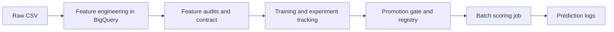
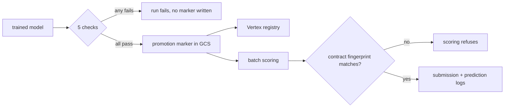

# IEEE-CIS fraud detection pipeline

Batch fraud scoring on the [IEEE-CIS](https://www.kaggle.com/c/ieee-fraud-detection) dataset,
running on Google Cloud. BigQuery holds the data and computes the features, Dagster
orchestrates, LightGBM is the model, Vertex AI holds experiments and the registry, and a
Cloud Run Job does the scoring. Infrastructure is OpenTofu, CI is GitHub Actions.



Boundaries, what each box does not do, and why: [docs/architecture.md](docs/architecture.md).

| If you came here for | Start at |
| --- | --- |
| The data and the modelling | [`eda/`](eda/README.md), 51 notebooks with one question each, then [the six audits](src/fraud_detection/evaluation/README.md) |
| The pipeline and its boundaries | [orchestration.md](docs/orchestration.md), including the three asset graphs as a running instance renders them, then [code-structure.md](docs/code-structure.md) |
| The cloud and the infrastructure | [google-cloud.md](docs/google-cloud.md) for the service choices, [`iaac/`](iaac/README.md) for the OpenTofu, [setup.md](docs/setup.md) for the runbook |
| Whether the results hold up | [MEASUREMENTS.md](docs/MEASUREMENTS.md) for the numbers, [DECISIONS.md](DECISIONS.md) for what was reversed |
| Risk and model governance | [model-card.md](docs/model-card.md), [point-in-time.md](docs/point-in-time.md), [adversarial-drift.md](docs/adversarial-drift.md) |

## What the pipeline enforces

**A feature contract.** Four of six audits write verdicts into
[`references/feature-contract.json`](references/feature-contract.json), each rejection
recorded with the check that made it. Training stamps the contract's fingerprint onto the
model; scoring compares it against the file on disk and refuses to run on a mismatch.

**Point-in-time feature computation.** Every velocity aggregate uses a `RANGE … 1 PRECEDING`
window frame; `LAG`, `LEAD` and `ROWS` frames are banned, and tests assert they never appear in
the generated SQL. Details, and the leak this caught: [docs/point-in-time.md](docs/point-in-time.md).

**A promotion gate.** Five checks run inside `validation_gate` and raise `Failure`, so a
regressed candidate fails the Dagster run instead of being annotated — including a check on the
model's largest, weakest segment, because a pooled metric alone hides exactly that.



The numbers behind every claim above, and how far each can be trusted, are in
[docs/MEASUREMENTS.md](docs/MEASUREMENTS.md); what changed once they were measured is in
[DECISIONS.md](DECISIONS.md).

## Stack

| Layer | Choice |
| --- | --- |
| Orchestration | Dagster, software-defined assets, three code locations |
| Warehouse and transforms | BigQuery SQL |
| Training | LightGBM, scikit-learn |
| Tracking and registry | Vertex AI Experiments and Model Registry |
| Scoring | Cloud Run Job |
| IaC | OpenTofu |
| CI/CD | GitHub Actions: lint, tests, `tofu validate`, Dagster definition checks, image build and vulnerability scan on every PR; the dispatched push workflow attaches an SBOM and SLSA provenance |

Data processing stays portable, since Dagster and SQL run anywhere. The model lifecycle is
handed to managed services, because self-hosting a registry and its backups would not change
anything about the result.

## Quick start

```bash
uv venv && source .venv/bin/activate && uv sync
uv run ruff check . && uv run pytest
uv run dagster dev -w dagster/workspace.yaml -p 3000
```

The test suite needs no cloud access. One ingestion test reads a local sample at
`data/raw/train_transaction_sample.csv`, which is not committed because the competition terms
do not allow redistributing the data; create it from your own Kaggle download first. Running
the pipeline against the full dataset needs a GCP project, see [docs/setup.md](docs/setup.md).

## Every document

| | |
| --- | --- |
| [DECISIONS.md](DECISIONS.md) | Architectural decisions, dated, with the evidence behind each |
| [ATTRIBUTION.md](ATTRIBUTION.md) | What came from published Kaggle work and what this repository does differently |
| [docs/architecture.md](docs/architecture.md) | Modules, boundaries, and what is out of scope |
| [docs/google-cloud.md](docs/google-cloud.md) | Which GCP services are used, which are not, and the platform details behind both |
| [docs/MEASUREMENTS.md](docs/MEASUREMENTS.md) | Every number and how far it can be trusted |
| [docs/point-in-time.md](docs/point-in-time.md) | The leakage guarantee and its enforcement |
| [docs/feature-engineering.md](docs/feature-engineering.md) | The twelve engineered features and their entities |
| [docs/model-card.md](docs/model-card.md) | Intended use, weaknesses, preconditions for real deployment |
| [docs/adversarial-drift.md](docs/adversarial-drift.md) | What changes when the distribution has an author |
| [docs/orchestration.md](docs/orchestration.md) | Code locations, groups, jobs, checks, unused Dagster features |
| [docs/code-structure.md](docs/code-structure.md) | Import rules and the tests that enforce them |
| [docs/setup.md](docs/setup.md) | Local setup and runbook |
| [eda/README.md](eda/README.md) | 51 notebooks, one question each |
| [src/fraud_detection/evaluation/README.md](src/fraud_detection/evaluation/README.md) | The six audits and what each measures |
| [references/README.md](references/README.md) | Pinned artefacts |

## Repository layout

```text
config/                    admission policy, training and orchestration settings
dagster/                   workspace and instance configuration
eda/notebooks/             51 analyses, one question each
iaac/                      infrastructure as code (OpenTofu)
references/                feature contract, frequency maps, V-block column groups
schemas/                   BigQuery schemas, read by both Python and OpenTofu
src/fraud_detection/
    core/                  schema, feature contract, promotion marker, provenance, config
    evaluation/            the six feature audits, importable from a notebook
    feature_engineering/   SQL derivations, row-local features, scoring-history assembly
    training/              the modelling recipe, importable from a notebook
    orchestration/         Dagster assets, resources, catalog labels
    serving/               /predict and /health, for the registry's container contract
    cli/                   score-batch, noise-band, build-frequency-maps
tests/                     unit tests, including the point-in-time and layering rules
```

Two import rules, checked by [`tests/test_layering.py`](tests/test_layering.py):
`orchestration/` may import from anywhere and nothing may import from it, and nothing outside
it may import Dagster or a cloud SDK. Together they are what lets a notebook call the same
training function the pipeline runs.

## Scope

Raw data is not committed; the dataset requires a Kaggle account. Scoring is batch rather than
online, for the reasons in [docs/architecture.md](docs/architecture.md). This is a
demonstration system on a public dataset. It has never scored a live payment, and
[docs/model-card.md](docs/model-card.md) lists what would have to change before it could.
