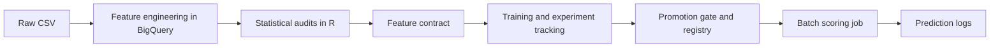
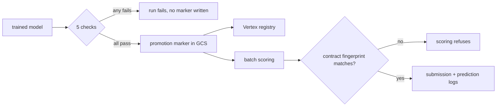

# IEEE-CIS fraud detection pipeline

Batch fraud scoring on the [IEEE-CIS](https://www.kaggle.com/c/ieee-fraud-detection) dataset,
running on Google Cloud. The analysis that decides which columns reach the model is R and
is stated as statistics; the model lifecycle is Python. BigQuery holds the data and
computes the features, Dagster orchestrates, LightGBM is the model, Vertex AI holds
experiments and the registry, and a Cloud Run Job does the scoring. Infrastructure is
OpenTofu, CI is GitHub Actions.



The contract is the seam. Everything left of it is inference — rank statistics,
weight-of-evidence tables, two-sample tests — and everything right of it is the model
lifecycle. Nothing crosses but a stamped JSON file.

Boundaries, what each box does not do, and why: [docs/architecture.md](docs/architecture.md).

| If you came here for | Start at |
| --- | --- |
| The data and the modelling | [`analysis/`](analysis/README.md) — the R half: eight analyses, one question each, every verdict a statistic with an interval on it |
| The pipeline and its boundaries | [orchestration.md](docs/orchestration.md), including the three asset graphs as a running instance renders them, then [code-structure.md](docs/code-structure.md) |
| The cloud and the infrastructure | [google-cloud.md](docs/google-cloud.md) for the service choices, [`iaac/`](iaac/README.md) for the OpenTofu, [setup.md](docs/setup.md) for the runbook |
| Whether the results hold up | [MEASUREMENTS.md](docs/MEASUREMENTS.md) for the numbers, [DECISIONS.md](DECISIONS.md) for what was reversed |
| Risk and model governance | [model-card.md](docs/model-card.md), [point-in-time.md](docs/point-in-time.md), [adversarial-drift.md](docs/adversarial-drift.md) |

## What the pipeline enforces

**A feature contract.** Four audits write verdicts into
[`references/feature-contract.json`](references/feature-contract.json), each rejection
recorded with the check that made it and the number behind it. Training stamps the
contract's fingerprint onto the model; scoring compares it against the file on disk and
refuses to run on a mismatch.

**Rejections that are tests, not thresholds.** Every verdict needs two keys: statistical
significance after a Benjamini–Hochberg correction across the scan, and a stated effect
size. At 100,000 rows per window almost everything is significant — 469 of 472 columns
move detectably — so significance alone decides nothing, and the materiality threshold is
what does the discriminating.

**Point-in-time feature computation.** Every velocity aggregate uses a `RANGE … 1 PRECEDING`
window frame; `LAG`, `LEAD` and `ROWS` frames are banned, and tests assert they never appear in
the generated SQL. Details, and the leak this caught: [docs/point-in-time.md](docs/point-in-time.md).

**A promotion gate.** Five checks run inside `validation_gate` and raise `Failure`, so a
regressed candidate fails the Dagster run instead of being annotated — including a check on the
model's largest, weakest segment, because a pooled metric alone hides exactly that.



The numbers behind every claim above, and how far each can be trusted, are in
[docs/MEASUREMENTS.md](docs/MEASUREMENTS.md); what changed once they were measured is in
[DECISIONS.md](DECISIONS.md).

## The audits, as statistics

Every verdict below is a test or an interval, not a threshold on a point
estimate, and nothing in the column is a model. Where a check rejects, it needs
two keys: significance after a Benjamini–Hochberg correction across the whole
scan, and an effect size above a stated threshold. At 100,000 rows per window the
first is nearly free — 469 of 472 columns shift detectably — so the second is
what actually decides.

| Question | Method | R | Feeds the contract |
| --- | --- | --- | --- |
| Does a column carry signal at all? | Somers' D, identical to AUC on the Mann–Whitney scale | `Hmisc::somers2` | yes |
| Is that signal distinguishable from none? | AUC with a DeLong confidence interval | `pROC::ci.auc` | yes |
| Did it change between an early and a late window? | DeLong's test for two AUCs, unpaired | `pROC::roc.test` | yes |
| Did it reverse direction? | Sign flips in the weight of evidence per bin, weighted by the mass they carry | own, on a pinned binning | yes |
| How much information does it carry? | Information value over the same bins | own | reported |
| Did the column's distribution move? | PSI against its **measured** null, drawn from the multivariate hypergeometric | own | yes |
| Is the move more than sampling noise? | Anderson–Darling and Cramér–von Mises, permutation p-values | `twosamples` | yes |
| Are the two periods distinguishable **jointly**? | Energy two-sample test — adversarial validation without the adversary | `energy::eqdist.etest` | reported |
| How strong is a categorical dependence, and how precisely known? | Cramér's V with Bergsma's correction, bootstrapped on the contingency table | `DescTools`, own | reported |
| Which columns restate their neighbours? | Variable clustering on rank correlation, cut on shared variance | `stats::hclust` on Spearman ρ² | yes |
| Which are *reconstructable* from the others? | Redundancy analysis on restricted cubic splines | `Hmisc::redun` | yes |
| How many dimensions does a block of V columns really have? | Horn's parallel analysis | `psych::fa.parallel` | reported |
| Are the binary M columns one latent thing? | Tetrachoric correlation | `psych::tetrachoric` | reported |
| Does an association survive conditioning on the product segment? | Cochran–Mantel–Haenszel | `stats::mantelhaen.test` | recorded, not applied |
| Is it the *same* association in every segment? | Breslow–Day test for homogeneity of odds ratios | `DescTools::BreslowDayTest` | recorded, not applied |
| Is a value missing at random? | Little's MCAR test, against always-observed columns | `naniar::mcar_test` | reported |
| Is the reconstructed customer real? | Label purity against a permuted null that keeps the group sizes | own | the `entity` block |
| Do the amounts look naturally generated? | Benford's law, with the effect size next to the p-value | `benford.analysis` | no |
| How heavy is the tail of the losses? | Power-law tail index, Clauset–Shalizi–Newman | `poweRlaw` | no |
| When did the fraud rate actually change? | Bai–Perron structural breaks | `strucchange::breakpoints` | no |
| Is there a daily cycle? | Rayleigh's test — hour of day is circular, not linear | `circular::rayleigh.test` | no |
| How concentrated is the customer base? | Gini and Herfindahl–Hirschman on transactions per entity | `ineq` | no |

And the descriptive pass, which asks what is in front of the audits rather than
whether a column can be trusted:

| Question | Method | Feeds the contract |
| --- | --- | --- |
| How much fraud is there, and does the rate hold still? | Wilson intervals on the daily rate | no |
| Where does the fraud sit? | Fraud rate per product and per device-info presence, with non-overlapping Wilson intervals | no |
| Does rarity predict fraud? | Fraud rate by frequency band, against each column's own base rate | no |
| What does the amount say on its own? | Weight of evidence and information value over the amount | no |
| Are the columns the type they claim? | Stored type against effective cardinality | no |

Reports: [`analysis/`](analysis/README.md), one notebook per question, rendered
with Quarto. Every one of them writes either a contract fragment or a table, and
`build-contract.qmd` merges the fragments without computing anything.

Two caveats that apply to everything above and are stated where they bite. The
windows are quantiles of the time value, so they hold equal numbers of rows and
**unequal amounts of calendar** — 22.6 days early against 35.1 late — and part of
what reads as a feature changing is the later window having watched for longer.
And the time column is never given to the joint two-sample test: with it present
any discriminator separates the periods perfectly, which is where the folklore
that "adversarial AUC is 1 on this competition" partly comes from.

## Stack

| Layer | Choice |
| --- | --- |
| Feature audits | R: `targets` graph, Quarto reports, `testthat`, `renv` lockfile |
| Orchestration | Dagster, software-defined assets, three code locations |
| Warehouse and transforms | BigQuery SQL |
| Training | LightGBM, scikit-learn |
| Tracking and registry | Vertex AI Experiments and Model Registry |
| Scoring | Cloud Run Job |
| IaC | OpenTofu |
| CI/CD | GitHub Actions, two jobs: Python (lint, tests, contract freshness, `tofu validate`, Dagster definition checks, image build and vulnerability scan) and R (`renv::restore()`, `testthat`, audit-graph validation). The dispatched push workflow attaches an SBOM and SLSA provenance |

Data processing stays portable, since Dagster and SQL run anywhere. The model lifecycle is
handed to managed services, because self-hosting a registry and its backups would not change
anything about the result.

## Quick start

```bash
uv venv && source .venv/bin/activate && uv sync
uv run ruff check . && uv run pytest
uv run dagster dev -w dagster/workspace.yaml -p 3000
```

The audits and the contract:

```bash
cd analysis && Rscript -e 'renv::restore()' && cd ..       # once: the pinned R library

uv run export-audit-frame                                  # the frame the model sees
cd analysis && Rscript -e 'targets::tar_make()' && quarto render
uv run stamp-contract                                      # the only thing that crosses back
```

The test suite needs no cloud access. One ingestion test reads a local sample at
`data/raw/train_transaction_sample.csv`, which is not committed because the competition terms
do not allow redistributing the data; create it from your own Kaggle download first. Running
the pipeline against the full dataset needs a GCP project, see [docs/setup.md](docs/setup.md).

## Every document

| | |
| --- | --- |
| [DECISIONS.md](DECISIONS.md) | Architectural decisions, dated, with the evidence behind each |
| [ATTRIBUTION.md](ATTRIBUTION.md) | What came from published Kaggle work and what this repository does differently |
| [docs/architecture.md](docs/architecture.md) | Modules, boundaries, and what is out of scope |
| [docs/google-cloud.md](docs/google-cloud.md) | Which GCP services are used, which are not, and the platform details behind both |
| [docs/MEASUREMENTS.md](docs/MEASUREMENTS.md) | Every number and how far it can be trusted |
| [docs/point-in-time.md](docs/point-in-time.md) | The leakage guarantee and its enforcement |
| [docs/feature-engineering.md](docs/feature-engineering.md) | The twelve engineered features and their entities |
| [docs/model-card.md](docs/model-card.md) | Intended use, weaknesses, preconditions for real deployment |
| [docs/adversarial-drift.md](docs/adversarial-drift.md) | What changes when the distribution has an author |
| [docs/orchestration.md](docs/orchestration.md) | Code locations, groups, jobs, checks, unused Dagster features |
| [docs/code-structure.md](docs/code-structure.md) | The R/Python seam, the import rule, and the tests that enforce both |
| [docs/setup.md](docs/setup.md) | Local setup and runbook |
| [analysis/README.md](analysis/README.md) | The R half: every audit, stated as a statistic |
| [references/README.md](references/README.md) | Pinned artefacts |

## Repository layout

```text
analysis/                  the R half: every audit and the descriptive pass
    R/                     rank statistics, weight of evidence, two-sample tests
    notebooks/             one question each, each writing a contract fragment
    build-contract.qmd     the merge, and the contract as a document
    out/                   fragments and tables, committed so a verdict can be looked up
    tests/testthat/        one suite per module, 59 blocks
config/                    admission policy, training and orchestration settings
dagster/                   workspace and instance configuration
iaac/                      infrastructure as code (OpenTofu)
references/                feature contract, frequency maps, V-block column groups
schemas/                   BigQuery schemas, read by both Python and OpenTofu
src/fraud_detection/      the Python half: the model lifecycle
    config.py              every setting, read from config/*.toml
    schema.py              the shared vocabulary: tables, columns, entity components
    contract/              the feature contract, and the command that stamps it
    features/              SQL derivations, row-local features, the entity key
    training/              the modelling recipe, importable from a notebook
    registry/              promotion marker and provenance record
    tools/                 hand-run commands that reach BigQuery or GCS
    serving/               /predict, /health, and the batch scoring job
    orchestration/         Dagster assets, resources, catalog labels
tests/                     unit tests, including the point-in-time and layering rules
```

**The two halves.** `analysis/` decides what is true of the data and is R; `src/` decides
what is done with a model and is Python. Nothing crosses but the stamped contract — no
Python in `analysis/`, no R in `src/`, and one JSON file between them.

**Inside the Python half**, every directory answers to exactly one box in the usual MLOps
vocabulary, and [code-structure.md](docs/code-structure.md) gives the mapping. A directory
answering to two is one whose name cannot tell you what belongs in it.

One import rule, checked by [`tests/test_layering.py`](tests/test_layering.py): `config`,
`schema`, `contract`, `features`, `training` and `registry` are the **pure layer** and may
not import Dagster or a cloud SDK; `tools`, `serving` and `orchestration` may, and nothing
in the pure layer may import them. That rule is what lets an analysis call the same
training function the pipeline runs.

## Scope

Raw data is not committed; the dataset requires a Kaggle account. Scoring is batch rather than
online, for the reasons in [docs/architecture.md](docs/architecture.md). This is a
demonstration system on a public dataset. It has never scored a live payment, and
[docs/model-card.md](docs/model-card.md) lists what would have to change before it could.
