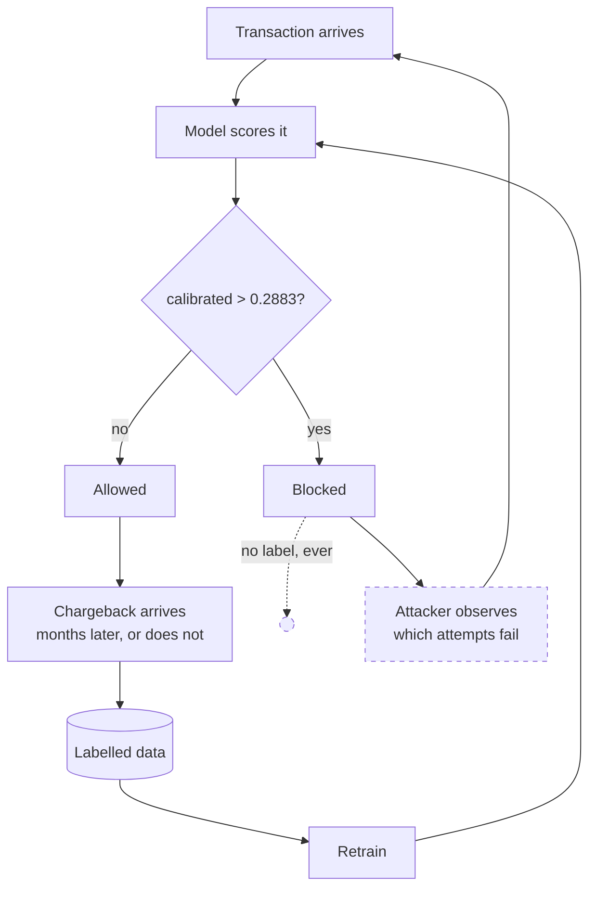

# Adversarial drift: what changes when the distribution has an author

> Fraud is the one ML problem where the data generating process reads your output and
> responds. This document works out what that implies for *this* system — which of its
> assumptions survive, which checks stop meaning what they say, and what would have to be
> built before any of it could be claimed.
>
> Numbers: [MEASUREMENTS.md](MEASUREMENTS.md) · Architecture: [architecture.md](architecture.md)
> · Model card: [model-card.md](model-card.md) · Leakage: [point-in-time.md](point-in-time.md).
>
> **Status: analysis, not implementation.** Nothing in §7 is built. It is written down
> because the gap between "we monitor drift" and "we monitor an opponent" is the gap
> between this project and a production fraud system, and naming it precisely is worth more
> than a cron job that would not close it.

---

## 1. The distinction the drift check cannot make

Every drift measurement in this repository — [`distribution_shift.py`](../src/fraud_detection/evaluation/distribution_shift.py),
the PSI thresholds in `config/feature-admission.toml`, the adversarial-validation test —
computes the same quantity: how far has the distribution of column *X* moved between a
reference window and a recent one. That quantity is well defined and the implementation is
sound. What it cannot do is say **why** the distribution moved, and in fraud there are two
answers that demand opposite responses.

**Exogenous drift** is the world changing on its own. Christmas arrives; a merchant
onboards in a new country; a card network reissues a BIN range; the population of devices
shifts as a phone generation ages out. The model's assumptions decay, and the fix is the
ordinary one: retrain on recent data, and the decay reverses.

**Endogenous drift is the model's own reflection.** The system starts declining at
`calibrated_probability > 0.2883`. Whoever is on the other side notices — not by reading
the threshold, but by observing that some attempts succeed and others do not — and moves
their behaviour to where the score is lower. The distribution of the features they control
changes *because of the decision rule*, and retraining on the result does not reverse the
decay. It teaches the model that the new behaviour is normal, which is precisely the
adaptation the attacker was paying for.

The measurement is identical in both cases. PSI on `TransactionAmt` rises to 0.31; the
audit rejects the column; the pipeline proceeds. Nothing in the number distinguishes
"holiday season" from "they found the ceiling". **This system currently assumes the first
reading in every case, and it assumes it silently** — not as a considered default, but
because the second reading was never represented in the design.

That is the whole document in one paragraph. Everything below is consequence.

## 2. The loop this system does not close

Here is what the deployed system would actually do, drawn as the loop it is rather than the
pipeline it is written as:

Two edges in that picture are the subject of this document, and neither exists in the code.

**The dashed edge on the left is selective labelling.** A blocked transaction never
produces a chargeback, because it never settles. At the operating point the model blocks
with precision 0.612 — so of every 1,000 blocks, roughly 388 are legitimate customers who
will never appear in a training set as the false positives they were, and 612 are frauds
that will never appear as the true positives they were. **The training data of every
subsequent model is drawn from the set of transactions the previous model allowed.** That
is not drift; it is a censoring mechanism, and it compounds with each retrain. The model
learns the fraud its predecessor missed and forgets the fraud its predecessor caught, which
over enough cycles is a model that is confidently wrong about exactly the patterns it used
to detect.

Nothing in this repository is aware of that. The splits in
[`splits.py`](../src/fraud_detection/orchestration/assets/splits.py) are time-based cuts of
a complete labelled history — appropriate for a competition dataset, where every row has an
`isFraud` regardless of what any model would have done, and structurally unavailable in
production.

**The solid edge on the right is the opponent.** Nothing in the system models the fact that
`ADV` exists. The gate's four checks, the PSI audits and the point-in-time guarantee are
all statements about a *fixed* joint distribution. They are correct statements. They are
statements about the wrong object.

## 3. What the opponent can actually reach

Not all 184 admitted features are equally exposed. Sorting them by who controls the value
is the single most useful thing that can be said about this model's adversarial surface,
and it has not been done anywhere else in the project.

| Tier | Columns | Who sets the value | Cost of moving it |
| --- | --- | --- | --- |
| **Directly controlled** | `TransactionAmt`, `ProductCD`, `P_emaildomain`, `R_emaildomain`, `DeviceInfo`, `DeviceType`, parts of `id_30`–`id_33` | The attacker, per transaction, at will | Near zero. A different amount, a different mailbox, a different user-agent string. |
| **Indirectly controlled** | the 12 velocity aggregates — `card_txn_count_1h`, `card_txn_count_24h`, `card_amt_avg_prior`, `seconds_since_prev_txn`, and the client and device equivalents | The attacker, through *timing and volume* | Low, and it costs them throughput rather than money: slow down, spread across more cards, wait out the window. |
| **Contested** | `card1`–`card6`, `addr1`, `addr2` | The attacker chooses which stolen card and which address to use, from what they hold | Bounded by their inventory. |
| **Not reachable** | `C1`–`C14` (counting features), `D1`–`D15` (timedeltas), `V1`–`V339` (Vesta's own engineered block), `M1`–`M9` (match flags) | The issuer, the network and Vesta's internal history | High to impossible — these are computed from records the attacker cannot write to. |

**The top SHAP drivers are `C13`, `C5`, `P_emaildomain`, `TransactionAmt`, `C1`.** Three of
the five are in the unreachable tier, which is the good news and is not an accident: counting
features over an issuer's own history are expensive to forge because forging them means
actually having the history. The other two are in the cheapest tier.

That split is the model's adversarial profile in one line: **its strongest signals are
robust and its cheapest-to-move features are load-bearing.** How load-bearing is not known,
because the question has never been asked in the form that would answer it — the ablation
that matters is not "what does PR-AUC lose if I remove `TransactionAmt`", it is "what does
PR-AUC become if an adversary sets `TransactionAmt` to whatever minimises the score, subject
to still being worth stealing". §7 states what that measurement would look like.

### The velocity features deserve a paragraph of their own

They are the twelve features this project *built* — the point-in-time aggregates that
[point-in-time.md](point-in-time.md) spends two thousand words getting right. They are also
tier two: their values are a function of the attacker's own tempo.

An attacker who understands that `card_txn_count_1h` is in the model does not need to know
its coefficient. They need to make it small, and making it small is free — it means waiting.
Every velocity feature in this system has an evasion whose cost to the attacker is patience
and whose cost to the defender is that the feature stops separating.

There is a sharp irony here worth stating rather than hiding. Five of those twelve features
were already rejected by the audits for drifting — `device_txn_count_24h` at PSI 0.889,
`seconds_since_prev_txn_client` at 0.597, `client_txn_count_prior` at 0.552 — and
[MEASUREMENTS.md](MEASUREMENTS.md) argues, correctly for a static dataset, that the drift is
by construction: a lifetime counter must distribute differently in a late window than an
early one. **Under an adversary, the same numbers admit a third reading that the static
argument cannot rule out**: a counter's distribution shifting is exactly what deliberate
tempo reduction looks like. On this dataset the "by construction" reading is right, because
there is no opponent in a fixed historical file. In production, the two readings produce
the same PSI and require opposite responses, and there is no threshold on PSI that separates
them.

## 4. The clock, and why the defender's is slower

The asymmetry that decides fraud systems is not accuracy. It is loop time.

The attacker's loop is: attempt, observe success or failure, adjust. It closes in
**seconds**, and the feedback is perfect — a decline is an unambiguous label delivered
instantly, for free, at the point of attack.

The defender's loop is: transaction settles, cardholder notices, cardholder disputes,
issuer raises a chargeback, the label lands in a warehouse, the label accumulates into
enough volume to retrain, the model retrains, the gate approves, the artifact promotes.
It closes in **weeks to months**, and the feedback is partial (§2) and noisy.

This project already respects that asymmetry in one place, and it is the most
domain-literate decision in the repository: the **10% gap** between train and validation,
59,054 rows deliberately left unassigned, because "a chargeback arrives months after the
transaction, so the most recent period is never finished being labelled at deployment
time." A validation window flush against training measures a situation nobody ever has.

What the project does *not* do is carry that reasoning forward to its conclusion. If the
freshest usable labels are one gap-width old, then:

- **The model is always fighting the last campaign.** By the time a fraud pattern has
  produced enough chargebacks to be learnable, it has been running long enough to be
  worth abandoning.
- **Retraining more often does not help past a point.** Retraining weekly on labels that
  mature monthly retrains on the same data with more steps. The binding constraint is
  label maturity, not compute or orchestration — which means that "automate the retrain
  schedule", the thing this project is repeatedly tempted to build, is not the improvement
  it appears to be.
- **Anything that reacts faster than the label clock has to be unsupervised.** Rules,
  velocity limits, anomaly detection on the score distribution — signals that do not wait
  for a chargeback. This is why real fraud stacks are hybrid, and the absence of a rules
  layer here is a domain gap, not a stylistic one.

## 5. Why the promotion gate cannot see any of this

The gate is the strongest piece of engineering in the project. It is also, against an
adversary, measuring the wrong thing — and that is worth being precise about, because
"the gate protects us" is exactly the kind of belief this repository has already caught
itself holding once.

| Check | What it asserts | Why an adversary is invisible to it |
| --- | --- | --- |
| PR-AUC ≥ 1.10 × baseline | The candidate ranks better than a logistic regression | Both are measured on the same held-out window. If that window's fraud has already adapted, both scores fall together and the ratio holds. |
| Cold-entity PR-AUC ≥ baseline | The model works on clients it has not seen | Measured over 38,649 rows of *historical* unseen clients. An adversary's new entities are not drawn from that distribution — that is the point of creating them. |
| ECE ≤ 0.02 | The probabilities mean what they say | Calibration is a property of the score against observed labels on a fixed sample. It says nothing about whether the sample is still representative, and a perfectly calibrated model on stale data is a precisely wrong model. |
| Test FPR ≤ 1.25 × budget | The threshold survives being carried forward | The strongest of the four, because it does test a *later* period — but the later period is later by weeks inside one static file, not later than a deployment the fraudsters could have responded to. |

Every check is offline, on a window that predates the model's own existence. **A held-out
set cannot contain a reaction to the model being held out from it.** No amount of
tightening the thresholds changes that; it is a property of the evaluation design, not of
the numbers. Offline validation bounds how well a model would have done against the past.
It says nothing about how long it will keep doing it.

## 6. What an adaptation actually looks like in the logs

If the goal is to detect adaptation rather than weather, it helps to write down what the
signature would be. Each of these is computable from `inference.prediction_logs` as it is
already recorded — id, raw score, calibrated probability, threshold, action, model run and
now `code_version` — which is the one genuinely valuable thing already in place.

**Score mass migrating to just below the threshold.** The single clearest tell. Exogenous
drift moves the whole score distribution, or a segment of it, in no particular relation to
`0.2883`. An adversary probing a boundary produces a *pile-up immediately beneath it* —
attempts tuned until they pass, which means tuned until they land just under. The
measurement is the density of `calibrated_probability` in `[0.25, 0.2883)` relative to
`[0.2883, 0.33)`, tracked over time. **A threshold is a public API you did not document,
and this ratio is the access log.**

**A block rate that falls while the population does not change.** If the share of scored
rows above the threshold declines and the entity mix, amount distribution and merchant mix
are stable, the model is not getting better. Something is getting under it.

**Novel entities arriving faster than the business grew.** New `card1`, new device, new
reconstructed client per day, against the baseline rate. Entity churn is a cost the
attacker pays to defeat velocity features, so a rise in churn without a corresponding rise
in genuine new customers is them paying it.

**The near-threshold band's chargeback rate rising.** The slowest signal and the most
conclusive: of the transactions allowed at `[0.25, 0.2883)`, what share eventually charges
back, and is that share climbing? Rising realised fraud in the band immediately below the
cut is adaptation confirmed rather than suspected. It arrives on the label clock (§4), so
it confirms; it never warns.

**Velocity features flattening across the board.** `card_txn_count_1h` and its siblings all
compressing toward their low end, together, is the signature of deliberate tempo reduction.
Individually each is unremarkable; the *joint* move is not.

Note what these have in common: **none of them is a PSI on a feature.** They are all
statements about the relationship between the score, the threshold and time. That is the
methodological point — monitoring an opponent means monitoring the decision boundary, not
the input distribution.

## 7. What would have to be built

Ordered by cost, with what each buys. None of it exists.

**1. A near-threshold density metric.** A daily query over `inference.prediction_logs`
computing the mass ratio from §6, as a Dagster asset with an `asset_check` that fails on a
sustained rise. Cheap — one SQL query, one check — and it is the highest-value single
addition in this list, because it converts an existing table into a boundary-probing
alarm.

**2. An exploration hold-out, and the courage to pay for it.** The censoring in §2 has one
known remedy: allow a small random sample of transactions *above* the threshold, and use
their eventual labels as the unbiased estimate of what blocking is actually catching. It
costs real fraud losses — at 0.612 precision, letting through 1% of blocks means letting
through fraud on purpose — and it is the only way to measure the block set's true composition
rather than assume it. The design question is the sampling rate and it is a business
decision, not a modelling one. Worth stating plainly: **a fraud system without an
exploration hold-out cannot measure its own precision after its first retrain.**

**3. Adversarial feature ablation, in the gate.** Not "drop the column and remeasure" but:
for each tier-one and tier-two feature, recompute PR-AUC with that feature set to its
score-minimising value on the fraud rows. That is a lower bound on performance against an
opponent who has solved for that feature. It runs offline on existing data, needs no new
infrastructure, and would produce the first honest number about how much of the 0.5175
survives a competent attacker. **This is the cheapest way to make the gate adversarially
aware, and the one I would build second.**

**4. A rules layer in front of the model.** Deterministic velocity and amount limits that
react on the transaction clock rather than the label clock (§4). Rules are worse than models
at ranking and better than models at responding this afternoon, and every production fraud
stack runs both for that reason. This project has none, and `architecture.md` does not
currently list its absence as a scope decision — it should.

**5. Champion/challenger with a live traffic split.** The only way to get an unbiased
comparison of two decision policies is to run both on comparable traffic. Offline
comparison on a shared window (§5) cannot distinguish "better model" from "model better
suited to a past that has ended". Expensive: two live policies, a split, and the analysis
to read it.

**6. Cohort-anchored retraining.** Given §2 and §4, retraining should be triggered by
label maturity and boundary-probing signals, not by a cron. The `model_factory` schedule at
04:00 daily encodes exactly the wrong trigger, and with no hosted Dagster it is at least
honest that it does not fire.

## 8. What this dataset can and cannot support

The IEEE-CIS data is a fixed historical file. No model was deployed against it; nobody
adapted to anything; the fraud in the test window is not a response to the fraud in the
training window. **Every claim in this document is therefore an argument, not a
measurement**, and the repository's own standard — [MEASUREMENTS.md](MEASUREMENTS.md),
"numbers, not narrative" — says that distinction has to be visible.

What *could* be measured on this data, honestly:

- The adversarial ablation in §7.3. It needs no opponent, only a pessimistic assumption,
  and it produces a real number.
- The near-threshold density metric in §7.1, computed over the scored test period. It has
  no adaptation in it, so the value is a **baseline** — which is exactly what it is for.
- The tier assignment in §3, extended into the contract itself: a `control_tier` field on
  each admitted column, so that "how much of this model rests on attacker-controlled
  input?" is answerable from `feature-contract.json` rather than from a table in a document.

What cannot be measured here at any price: whether any of the §6 signatures actually fires
on real adaptation. That needs a deployed system, an opponent, and time. Simulating it —
perturbing the test set to mimic an attacker and declaring the detector works — would be
measuring the perturbation, and would tell us only that the thing we injected is the thing
we found.

## 9. The short version

1. PSI cannot tell "the world moved" from "we moved it". This system assumes the first,
   silently, in every case.
2. Blocked transactions never get labels, so every retrain learns from the previous model's
   mistakes and forgets its successes. Nothing here is aware of that.
3. The model's strongest features are unreachable to an attacker and its cheapest features
   are load-bearing. How load-bearing has never been measured.
4. The velocity features this project built are the ones with the cheapest evasion, and
   evading them looks identical to the drift the audits already flagged.
5. The attacker's feedback loop closes in seconds; the defender's closes in months. Nothing
   that waits for a chargeback can be the fast half of the response.
6. The promotion gate is excellent and structurally blind to all of this, because a
   held-out window cannot contain a reaction to the model held out from it.
7. Detecting an opponent means monitoring the decision boundary, not the input
   distribution — and `inference.prediction_logs` already records what that would need.
