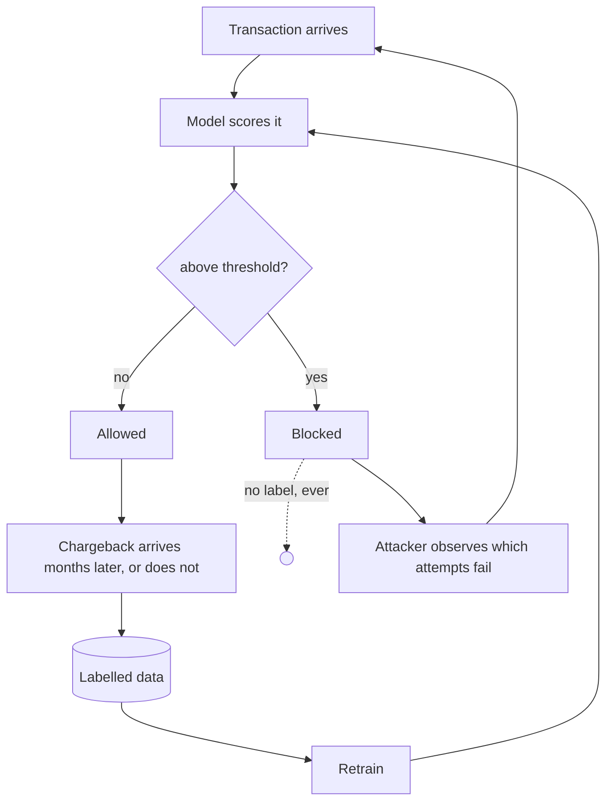

# Adversarial drift

Fraud is one of the few ML problems where the data generating process reads your output and
responds. This document works out what that implies for this system: which assumptions
survive, which checks stop meaning what they say, and what would have to be built.

Status: analysis, not implementation. Nothing in §6 exists. The IEEE-CIS data is a fixed
historical file, no model was deployed against it and nobody adapted to anything, so every
claim here is an argument rather than a measurement. §7 separates what could still be measured
on this data from what could not.

## 1. The distinction PSI cannot make

Every drift measurement in this repository computes the same quantity: how far the
distribution of column *X* moved between a reference window and a recent one. That quantity is
well defined. What it cannot say is why the distribution moved, and in fraud there are two
answers that demand opposite responses.

Exogenous drift is the world changing on its own: Christmas, a merchant onboarding in a new
country, a BIN range reissued, a phone generation ageing out. The fix is to retrain on recent
data, and the decay reverses.

Endogenous drift is the model's own reflection. The system declines above a threshold, whoever
is on the other side notices which attempts succeed, and moves their behaviour to where the
score is lower. The distribution of the features they control changes because of the decision
rule, and retraining on the result teaches the model that the new behaviour is normal, which
is the adaptation the attacker was paying for.

The measurement is identical in both cases. PSI on `TransactionAmt` rises to 0.31, the audit
rejects the column, the pipeline proceeds. This system assumes the exogenous reading in every
case, and it assumes it silently, because the other reading was never represented in the
design.

## 2. Two edges that are missing from the loop

**Selective labelling.** A blocked transaction never settles, so it never produces a
chargeback. At precision 0.603, of every 1,000 blocks roughly 397 are legitimate customers who
will never appear in a training set as the false positives they were, and 603 are frauds that
will never appear as the true positives they were. The training data of every subsequent model
is drawn from the set of transactions the previous model allowed. That is a censoring
mechanism, and it compounds with each retrain: the model learns the fraud its predecessor
missed and forgets the fraud its predecessor caught.

Nothing in this repository is aware of that. The splits in
[`splits.py`](../src/fraud_detection/orchestration/assets/splits.py) are time-based cuts of a
complete labelled history, which is appropriate for a competition dataset where every row has
an `isFraud` regardless of what any model would have done, and unavailable in production.

**The opponent.** Nothing in the system models the fact that one exists. The gate's checks, the
PSI audits and the point-in-time guarantee are all statements about a fixed joint distribution.
They are correct statements about the wrong object.

## 3. What the opponent can reach

Sorting the 205 admitted features by who controls the value is the most useful thing that can
be said about this model's adversarial surface.

| Tier | Columns | Who sets the value | Cost of moving it |
| --- | --- | --- | --- |
| Directly controlled | `TransactionAmt`, `ProductCD`, `P_emaildomain`, `R_emaildomain`, `DeviceInfo`, `DeviceType`, parts of `id_30`–`id_33` | The attacker, per transaction | Near zero: a different amount, mailbox or user-agent string |
| Indirectly controlled | the velocity aggregates over card, device and client | The attacker, through timing and volume | Low, and paid in throughput rather than money: slow down, spread across more cards, wait out the window |
| Contested | `card1`–`card6`, `addr1`, `addr2` | The attacker chooses which stolen card and address to use | Bounded by their inventory |
| Not reachable | `C1`–`C14`, `D1`–`D15`, `V1`–`V339`, `M1`–`M9` | The issuer, the network and Vesta's internal history | High to impossible: computed from records the attacker cannot write to |

The top SHAP drivers are `C13`, `C5`, `P_emaildomain`, `TransactionAmt`, `C1`. Three of the
five are in the unreachable tier, which is not an accident: counting features over an issuer's
own history are expensive to forge, because forging them means actually having the history.
The other two are in the cheapest tier.

So the model's strongest signals are robust and its cheapest-to-move features are load-bearing.
How load-bearing is unknown, because the ablation that would answer it is not "what does PR-AUC
lose if I remove `TransactionAmt`" but "what does PR-AUC become if an adversary sets
`TransactionAmt` to whatever minimises the score, subject to the transaction still being worth
stealing". See §6.3.

### The velocity features

The twelve aggregates this project built are tier two: their values are a function of the
attacker's own tempo. An attacker who knows `card_txn_count_1h` is in the model does not need
its coefficient, only to keep the count small, and keeping it small means waiting. Every
velocity feature here has an evasion whose cost to the attacker is patience and whose cost to
the defender is that the feature stops separating.

Four of the twelve are already rejected by the audits for drift: `device_txn_count_24h` at PSI
0.890, `seconds_since_prev_txn_client` at 0.597, `client_txn_count_prior` at 0.539, and
`client_amt_deviation_prior` on time consistency. [MEASUREMENTS.md](MEASUREMENTS.md) argues,
correctly for a static dataset, that a lifetime counter must distribute differently in a late
window than an early one. Under an adversary the same numbers admit a third reading that the
static argument cannot rule out, because a counter's distribution shifting is what deliberate
tempo reduction looks like. On this dataset the first reading is right; in production the two
readings produce the same PSI and require opposite responses.

## 4. The clock

The asymmetry that decides fraud systems is loop time, not accuracy.

The attacker's loop is attempt, observe, adjust. It closes in seconds and the feedback is
perfect: a decline is an unambiguous label delivered instantly at the point of attack.

The defender's loop is settle, dispute, chargeback, warehouse, accumulate, retrain, gate,
promote. It closes in weeks to months and the feedback is partial (§2) and noisy.

This project respects that asymmetry in one place: the unassigned gap between train and
validation, because a chargeback arrives months after the transaction and the most recent
period is never finished being labelled at deployment time. Carried forward, the same reasoning
says three more things:

- The model is always fighting the last campaign. By the time a pattern has produced enough
  chargebacks to be learnable, it has been running long enough to be worth abandoning.
- Retraining more often does not help past a point. Retraining weekly on labels that mature
  monthly retrains on the same data with more steps. The binding constraint is label maturity,
  which makes "automate the retrain schedule" less of an improvement than it looks.
- Anything that reacts faster than the label clock has to be unsupervised: rules, velocity
  limits, anomaly detection on the score distribution. This is why production fraud stacks are
  hybrid, and the absence of a rules layer here is a domain gap rather than a stylistic one.

## 5. Why the gate cannot see any of this

| Check | What it asserts | Why an adversary is invisible to it |
| --- | --- | --- |
| PR-AUC ≥ 1.10 × baseline | The candidate ranks better than the BQML baseline | Both are measured on the same held-out window. If that window's fraud has already adapted, both scores fall together and the ratio holds. |
| Cold-entity PR-AUC ≥ baseline | The model works on clients it has not seen | Measured over historical unseen clients. An adversary's new entities are not drawn from that distribution; that is the point of creating them. |
| ECE ≤ 0.02 | The probabilities mean what they say | Calibration is a property of the score against labels on a fixed sample. A perfectly calibrated model on stale data is precisely wrong. |
| Test FPR ≤ 1.25 × budget | The threshold survives being carried forward | The strongest of the four, because it does test a later period, but later by weeks inside one static file rather than later than a deployment anyone could have responded to. |

Every check is offline, on a window that predates the model's own existence. A held-out set
cannot contain a reaction to the model being held out from it. Tightening thresholds does not
change that, because it is a property of the evaluation design.

## 6. What would have to be built

Ordered by cost. None of it exists.

1. **A near-threshold density metric.** A daily query over `inference.prediction_logs`
   computing the mass just below the threshold against the mass just above, as an asset with a
   check that fails on a sustained rise. One SQL query and one check, and it converts an
   existing table into a boundary-probing alarm.
2. **An exploration hold-out.** The censoring in §2 has one known remedy: allow a small random
   sample of transactions above the threshold and use their eventual labels as an unbiased
   estimate of what blocking is catching. It costs real fraud losses, and the sampling rate is a
   business decision rather than a modelling one. Without it, a fraud system cannot measure its
   own precision after the first retrain.
3. **Adversarial feature ablation in the gate.** For each tier-one and tier-two feature,
   recompute PR-AUC with that feature set to its score-minimising value on the fraud rows. That
   is a lower bound on performance against an opponent who has solved for that feature. It runs
   offline on existing data and would produce the first real number about how much of the
   current PR-AUC survives a competent attacker.
4. **A rules layer in front of the model**, reacting on the transaction clock rather than the
   label clock (§4). Rules are worse than models at ranking and better at responding this
   afternoon.
5. **Champion/challenger with a live traffic split.** The only unbiased way to compare two
   decision policies. Offline comparison on a shared window (§5) cannot distinguish a better
   model from one better suited to a past that has ended.
6. **Cohort-anchored retraining**, triggered by label maturity and boundary-probing signals
   rather than by a cron.

### What adaptation would look like in the logs

Each of these is computable from `inference.prediction_logs` as already recorded: id, raw
score, calibrated probability, threshold, action, model run, code version.

- **Score mass migrating to just below the threshold.** The clearest signal. Exogenous drift
  moves the distribution in no particular relation to the cut; an adversary probing the boundary
  produces a pile-up immediately beneath it, since attempts tuned until they pass are attempts
  tuned until they land just under.
- **A block rate that falls while the population does not change.** If the share above the
  threshold declines while entity mix, amounts and merchant mix are stable, something is getting
  under the model.
- **Novel entities arriving faster than the business grew.** Entity churn is a cost the attacker
  pays to defeat velocity features, so a rise without a corresponding rise in genuine new
  customers is them paying it.
- **The near-threshold band's chargeback rate rising.** The slowest and most conclusive signal.
  It arrives on the label clock, so it confirms and never warns.
- **Velocity features flattening together.** Individually unremarkable; the joint move is the
  signature of deliberate tempo reduction.

None of these is a PSI on a feature. They are statements about the relationship between the
score, the threshold and time, which is the methodological point: monitoring an opponent means
monitoring the decision boundary rather than the input distribution.

## 7. What this dataset can and cannot support

Measurable here:

- The adversarial ablation in §6.3. It needs no opponent, only a pessimistic assumption.
- The near-threshold density metric over the scored test period. With no adaptation in it, the
  value is a baseline, which is what it is for.
- The tier assignment in §3, moved into the contract as a `control_tier` field per admitted
  column, so "how much of this model rests on attacker-controlled input" is answerable from
  `feature-contract.json` rather than from a table in a document.

Not measurable here at any price: whether any of the signatures above fires on real adaptation.
That needs a deployed system, an opponent and time. Perturbing the test set to mimic an attacker
and declaring the detector works would measure the perturbation.
