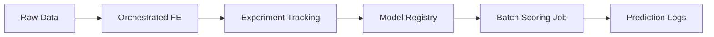
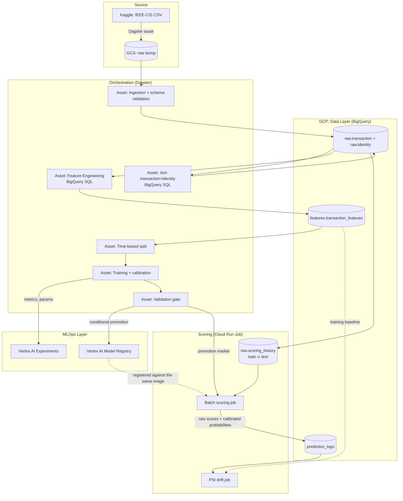

# Architecture: IEEE-CIS Fraud Detection Platform

> Architecture document — **what** we build and **why** it looks this way. Changes rarely.
> Numbers: [MEASUREMENTS.md](MEASUREMENTS.md).
> Leakage guarantee in full: [point-in-time.md](point-in-time.md).
> What the data looks like: [../eda/notebooks/README.md](../eda/README.md) · Feature contract: [feature-engineering.md](feature-engineering.md).
> Where the code lives: [code-structure.md](code-structure.md) · Feature audits: [../src/fraud_detection/evaluation/README.md](../src/fraud_detection/evaluation/README.md).

---

## 1. Scope and boundaries

A complete, automated MLOps pipeline for detecting fraud in e-commerce payments, built on
the [IEEE-CIS Fraud Detection](https://www.kaggle.com/c/ieee-fraud-detection) dataset.
Full model lifecycle: 



The dataset is Vesta payment transactions: multi-table (transaction + identity), strongly
imbalanced (~3.5% fraud), heavily anonymized, and genuinely temporal — which makes
time-based validation a correctness requirement rather than a stylistic preference.

### Deliberately out of scope

| Out of scope | Why |
| --- | --- |
| Causal inference / uplift modelling | Fraud detection is a **predictive** problem (classification). Causal methods answer a different question with different validation; combining them here would blur both. |
| Deep learning (MLP, autoencoder) as the production model | On tabular data with a ~3.5% positive class, gradient boosting is state of the art. Included as one honest ablation, not as the candidate. |
| Streaming ingestion (Kafka and similar) | The dataset is static and offline. Replaying a holdout as a simulated stream gives the same monitoring signal without inventing infrastructure. |
| Multi-region / HA deployment | Serving is stateless and scales to zero. Regional deployment is sufficient for the failure model this system actually has. |
| Online serving (a live `/predict` endpoint with feature retrieval) | Scoring is **batch** — §3. An online decision is worth its cost only when it has to be taken *during* the transaction; here it does not. The image does carry `/predict` and `/health`, but for the registry's container contract, not because anything calls it: the point lookup against entity state is the part that is not built, and it is the hard part. |
| Automated Model Monitoring (Drift) | The drift checks (`distribution_shift`) already implement the logic, and `inference.prediction_logs` now records what a scheduled job would read. Running it on a cron for a static dataset is operational theater; the precondition for not being theater is in place. There is no drift *asset* and no schedule pointing at one — the three schedules above cover the ingest, training and scoring pipelines, not monitoring. Why that gap is larger than it looks once an adversary is assumed: [adversarial-drift.md](adversarial-drift.md). |
| Automated promotion → deploy | CI builds and pushes the image on merge, so there is a real artefact and a real push. Rolling the job onto a new tag stays a `tofu apply` with the SHA. Automating the last hop for a project with one operator removes a decision without removing any work. |
| Hosted Orchestrator | Running Dagster locally proves the orchestration logic. Hosting it is just a cloud bill. **Consequence worth stating:** each of the three code locations declares a `ScheduleDefinition` (`feature_platform` daily at 00:00, `model_factory` at 04:00, `inference` at 08:00). With no hosted daemon those crons fire only while somebody is running `dagster dev`, which in practice means they do not fire. They describe the intended cadence; they are not a claim that anything runs unattended. |

---

## 2. Tech stack

### Where the boundary between open source and managed services sits

The stack is not uniformly open source or uniformly cloud-native, and the split is the
main architectural decision in the project:

- **Data processing stays portable.** Dagster is a market standard that runs anywhere, and
  the transformation logic — where the domain knowledge and most of the code lives —
  is SQL. That is the most portable form it could take: the orchestration carries no
  vendor semantics, and the queries would move to another warehouse with dialect edits
  rather than a rewrite.
- **Model lifecycle is handed to managed services.** Registry, serving and monitoring are
  undifferentiated infrastructure. Self-hosting a tracking server, a registry database
  and its backups buys nothing a team should be spending time on, and the operational
  debt compounds quietly.

The result is deliberate: flexible where the data is processed, managed where the model
is operated.

| Layer | Choice |
| --- | --- |
| Data warehouse | Google BigQuery |
| Data processing | BigQuery SQL, orchestrated by Dagster |
| Orchestration | Dagster (Software-Defined Assets) |
| Entity state at scoring time | A BigQuery table (`raw.scoring_history`) — the batch materialization of the same entity-keyed lookup §3.2 describes |
| Experiment tracking | **Vertex AI Experiments** (single tracker, via an `ExperimentTracker` resource) |
| Model registry (source of truth) | **Vertex AI Model Registry**, with a promotion marker in GCS as the record the scoring path reads |
| Baseline / ablation model | BigQuery ML |
| Training | LightGBM, scikit-learn |
| Scoring | **Cloud Run Job** — a container that runs to completion and exits |
| Monitoring | `inference.prediction_logs` + a hand-written PSI job |
| IaC | OpenTofu (Terraform) |
| CI/CD | GitHub Actions |

### Where the code lives

The stack table says which tools; this says which of them the code is allowed to know about.

```text
schema.py, evaluation/, training/, feature_contract/   pure    -> a notebook imports these
assets/, resources.py, definitions/                  Dagster -> only the orchestrator
```

`assets/` may import from anywhere; nothing may import from `assets/`. The rule exists so
the modelling recipe can be called by a notebook today and by a serving container later,
rather than reimplemented in each. Enforced by a test — see
[code-structure.md](code-structure.md).



---

## 3. Modules

Monorepo, four modules with clean boundaries.

### Module 1 — Data Engineering & Feature Store (Dagster + BigQuery)

1. **Ingestion.** Stage the raw Kaggle CSV into GCS (a separate, manually materialized
   asset — the dataset is static), then validate the schema and load into BigQuery. The
   raw table schema is pinned in Terraform, so a schema change shows up as a reviewable
   `tofu plan` diff instead of silently re-inferring on the next pipeline run.
2. **Join transaction + identity.** Two source tables, ~430 columns after the join,
   including the anonymized `V1–V339` block. A left join — identity covers only a subset
   of transactions, and the rest must survive — plus `null_count_V_block`, computed on raw
   nulls in the same statement because the missing-value pattern across that block is
   signal in its own right. One BigQuery query; the result never passes through the
   orchestrator's process. Column reduction over the V-block is a one-off offline analysis
   producing a pinned list, not a stage this query repeats.
3. **Point-in-time feature engineering.** Twelve velocity aggregates over three entities —
   six per card (`card1`), one per device (`DeviceInfo`), five per reconstructed client
   (`card1 + addr1 + (day − D1)`): transaction counts over 1h/24h and over all prior
   history, mean and sum of amounts, deviation from the entity's baseline, seconds since
   its previous transaction. Device and client aggregates are null-guarded, because SQL
   puts every NULL in one window partition and an unguarded aggregate over a nullable
   entity is a global volume proxy wearing a feature's name.

   *Leakage guarantee:* every window uses a `RANGE … 1 PRECEDING` frame. `RANGE` (unlike
   `ROWS`) frames on the `ORDER BY` **value**, so `1 PRECEDING` means "`TransactionDT`
   strictly less than the current row's" — it excludes both the current row and every peer
   sharing its exact timestamp. No transaction can ever see itself or the future.
   Positional functions (`LAG`, `LEAD`, `ROWS` frames) are banned for the same reason and
   are asserted absent by the tests. The full argument, the measured near-miss that
   produced that rule, and the empirical checks are in
   [point-in-time.md](point-in-time.md).

4. **Feature audits, and one contract.** Five checks — time consistency, distribution shift, entity purity, redundancy, selection — run as manually materialized assets when the *data* changes, not on every training run. Each writes a fragment; one asset merges them into `feature_contract.json`, committed to the repository so a change to the admitted set arrives as a reviewable diff. Three consumers> the drift check logic `distribution_shift(val, train)` and checks if any group size
> exceeds 5%. Since `TransactionDT` makes no sense outside the validation window, we use
> the adversarial test described in [evaluation/README.md](../src/fraud_detection/evaluation/README.md).

### Module 2 — Training Pipeline (Dagster + Vertex AI + LightGBM)

1. **Time-based split**, not random, on `TransactionDT`. In payments you predict the
   future from the past; K-Fold would leak the future into training. Additionally, a card
   proxy identifier must not appear in both train and test.
2. **Baseline in BigQuery ML.** One `CREATE MODEL` statement, wired through the tracker
   from the first run, so "PR-AUC above baseline" refers to a number somebody actually
   measured. It also exercises two things worth knowing about the managed path — the
   `TRANSFORM` clause, which bakes preprocessing into the model so training-serving skew
   becomes structurally impossible, and registration of a BQML model straight into the
   Vertex AI Model Registry. It is a reference point and an ablation row, not a candidate
   for production.
3. **LightGBM training** with `scale_pos_weight` (fraud ≈ 3.5%).
4. **Calibration** of raw scores into probabilities (isotonic vs Platt, settled with a
   reliability diagram). A ranking score is not a probability, and every downstream
   decision rule here assumes a probability.
5. **Decision threshold driven by a business budget**, not by `argmax F1` — e.g. "block at
   most 1% of legitimate transactions" — plus an explicit cost matrix.
6. **Tracking from the first model, not the last.** Every run — including the trivial
   baseline — is recorded in Vertex AI Experiments through one `ExperimentTracker`
   resource. One tracker, so there is never a second place to look for a number, and one
   metric implementation, so two models are always compared on the same measurement.
7. **Validation gate.** A model reaches the registry only after clearing thresholds
   (PR-AUC above baseline, no segment regressions, calibration sanity check). Promotion is
   never unconditional.
8. **Explainability:** SHAP — global importance, plus a handful of individual decisions.
   In a fraud context an unexplainable block is an operational problem, not just an
   analytical one.

### Module 3 — Batch scoring (Cloud Run Job)

Scoring is a **job**, not a service: a container that runs to completion and exits, with no
HTTP server waiting for a caller. That is the shape most production ML scoring actually
has. An online endpoint earns its cost when the decision must be taken *during* the
transaction; when it need not be, the endpoint is infrastructure with no decision behind
it.

1. **Which model.** The job reads the promotion marker the validation gate wrote and fails
   if there is none. It used to take the most recently modified `model.pkl` in the bucket,
   which is the *newest* model, not the *approved* one — and since training uploads the
   artifact before the gate runs, a rejected candidate scored just as readily as a promoted
   one. The gate had no effect at the only point where the model does anything. It also
   fails when a training run is newer than the marker: that state means either the gate
   rejected it or the gate has not run, and quietly picking either model would be a guess.

2. **Entity state at scoring time**, which is the part that took the longest to get right.
   The velocity features are windowed aggregates over a card's, device's and client's prior
   transactions. Computing them over the test period alone gives the first test transaction
   of every card an empty window — `card_txn_count_prior = 0`, `seconds_since_prev_txn`
   NULL — when 98.6% of test rows sit on a card that had history in the training period.
   The model was fitted on rows where those columns carried that history. **That is
   training-serving skew**, and it is worth saying plainly that
   [code-structure.md](code-structure.md) used to call skew "structurally prevented" here.
   It is not: layering prevents a transformation being *reimplemented*, and says nothing
   about the *state* it is applied to.

   The fix is `raw.scoring_history` = train ∪ test, with the aggregates computed over the
   union and only the test rows assembled into the model input. Point-in-time correctness
   is untouched — the frame is still `RANGE … 1 PRECEDING`, strictly earlier than the
   current row, so a test row sees every training row and every earlier test row and never
   its own future.

   This is the same semantics as §3.2's entity-keyed snapshot and point lookup, in a
   different materialization: a table computed once, rather than a lookup per request. The
   online path would not be a different architecture, only a different embodiment of this
   one — which is why it can stay out of scope without leaving a hole in the design.

3. **Raw scores to the leaderboard, calibrated probabilities to decisions.** One artifact,
   two consumers, different requirements. Kaggle grades on ROC-AUC, which reads only the
   ranking; the isotonic calibrator is a step function, so it creates ties and the ranking
   pays for them (0.5091 uncalibrated against 0.4992 calibrated —
   [MEASUREMENTS.md](MEASUREMENTS.md)). The threshold and the cost matrix are defined on
   the probability scale, so anything that blocks a payment reads the calibrated number.
   The submission carries raw scores; `prediction_logs` carries both.

4. **The contract fingerprint is checked, not just carried.** The model is stamped with the
   fingerprint of the contract it was trained against; the job compares it against the
   contract on disk and fails on a mismatch. A stamp nobody ever compares is decoration.

5. **Every scored row is logged** to `inference.prediction_logs` — id, raw score,
   calibrated probability, threshold, action, model run. Written before anything reads it,
   because a monitor added later can only look at history that was already being recorded.

6. **The registry entry is real.** `Model.upload` needs a serving container and LightGBM
   has no prebuilt one; registering against the prebuilt sklearn image would create an
   entry that cannot serve, which is worse than no entry. The batch job needed an image
   anyway, so that image also answers `/health` and `/predict` on Vertex's custom-container
   contract. One image, two entrypoints: the Cloud Run Job overrides the command, and the
   registry entry points at the same digest. The endpoint is not the online serving path
   of §3.2 — feature retrieval is still the caller's job — and the table above still says
   so.

### Module 4 — Infrastructure & CI/CD (OpenTofu + GitHub Actions)

1. **OpenTofu:** BigQuery datasets, a service account with separate dev/prod IAM profiles
   (prod gets `dataViewer` on `raw`, not `dataEditor`), GCS buckets, an Artifact Registry
   repository and the Cloud Run Job. `image_tag` has no default on purpose: an apply that
   forgets it errors instead of silently rolling the job back to a mutable tag.
2. **GitHub Actions on PR:** `ruff`, `pytest` (including the point-in-time and batch-scoring
   correctness tests), `tofu validate`, `dagster definitions validate` for all three code
   locations, and an image **build** — built, not pushed, because pushing from a pull
   request would put unreviewed code in the registry the job pulls from.
3. **On merge to `main`:** build and push the image to Artifact Registry, tagged with the
   git SHA, authenticated by Workload Identity Federation so no service-account key exists
   to leak. Rolling the job onto the new tag stays an explicit `tofu apply`.
4. **CI for the model, not just the app:** the validation gate runs in the training
   pipeline and fails the run, so a model that regresses never reaches the marker or the
   registry.

---

## 4. Decision log

Architectural and mathematical "why"s live in [`MEASUREMENTS.md`](MEASUREMENTS.md) at the
repository root — one entry per decision, dated. This file describes the target state;
`MEASUREMENTS.md` describes the path to it and the alternatives that were rejected.
