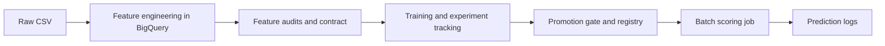

# Architecture

What this system is built from and why it is shaped this way. Numbers live in
[MEASUREMENTS.md](MEASUREMENTS.md), the leakage guarantee in
[point-in-time.md](point-in-time.md), the import rules in
[code-structure.md](code-structure.md), and the Dagster layout in
[orchestration.md](orchestration.md).

## 1. Scope

An automated pipeline for detecting fraud in e-commerce card-not-present payments, built on
the [IEEE-CIS](https://www.kaggle.com/c/ieee-fraud-detection) dataset: two source tables,
435 columns after the join, ~3.5% positives, and a real time axis, which makes time-based
validation a correctness requirement rather than a preference.

### Out of scope, with the reason

| Not built | Why |
| --- | --- |
| Causal inference / uplift modelling | This is a predictive classification problem. Causal methods answer a different question and validate differently. |
| Deep learning as the production model | On tabular data with a ~3.5% positive class, gradient boosting is the right default. Kept as one ablation, not as a candidate. |
| Streaming ingestion | The dataset is a static file. Replaying a holdout gives the same monitoring signal without new infrastructure. |
| Multi-region / HA | Serving is stateless and scales to zero. Regional deployment matches the failure model this system actually has. |
| Online serving with feature retrieval | Scoring is batch (§4). The image does answer `/predict` and `/health`, but only to satisfy the registry's container contract. The unbuilt part is the point lookup against entity state, and that is the hard part. |
| Scheduled drift monitoring | The drift logic exists in `distribution_shift` and `inference.prediction_logs` records what a scheduled job would read, but no asset or schedule runs it. What the gap costs once an adversary is assumed: [adversarial-drift.md](adversarial-drift.md). |
| Automated deploy on promotion | CI builds and pushes the image on merge. Rolling the Cloud Run Job onto a new tag stays a `tofu apply` with the SHA, because automating the last hop for a single-operator project removes a decision without removing work. |
| Hosted Dagster | Running it locally proves the orchestration logic; hosting it is a cloud bill. The consequence is stated in §6. |
| A rules layer in front of the model | Every production fraud stack runs one, because rules react on the transaction clock rather than the label clock. This system has none, and [adversarial-drift.md](adversarial-drift.md) §4 explains why that is a domain gap rather than a stylistic one. |

## 2. Stack

| Layer | Choice |
| --- | --- |
| Data warehouse | BigQuery |
| Transformations | BigQuery SQL, orchestrated by Dagster |
| Orchestration | Dagster, software-defined assets |
| Entity state at scoring time | `raw.scoring_history`, the batch materialization of the entity-keyed lookup an online path would do per request |
| Experiment tracking | Vertex AI Experiments, through one `ExperimentTracker` resource |
| Model registry | Vertex AI Model Registry, with a promotion marker in GCS as the record the scoring path reads |
| Baseline | BigQuery ML |
| Training | LightGBM, scikit-learn |
| Scoring | Cloud Run Job |
| Monitoring inputs | `inference.prediction_logs` and a hand-written PSI job |
| IaC | OpenTofu |
| CI/CD | GitHub Actions |

The split between open source and managed services is the main architectural decision here.
Data processing stays portable: Dagster runs anywhere and the transformation logic, which is
where the domain knowledge sits, is SQL. The model lifecycle goes to managed services,
because a self-hosted tracking server and registry database are undifferentiated
infrastructure whose operational debt compounds quietly.

## 3. Data and features

1. **Ingestion.** The raw Kaggle CSVs are staged into GCS by a manually materialized asset,
   then validated and loaded into BigQuery against a pinned schema. The schema lives in
   [`schemas/`](../schemas/) and is also read by OpenTofu, so a schema change is a reviewable
   `tofu plan` diff rather than a silent re-inference on the next load.
2. **Join.** `transaction` left-joined to `identity` on `TransactionID`, plus
   `null_count_V_block` computed on raw nulls in the same statement, because the missingness
   pattern across `V1–V339` is signal in its own right. One BigQuery statement; the frame
   never passes through the orchestrator.
3. **Velocity features.** Twelve aggregates over three entities: six per card (`card1`), one
   per device (`DeviceInfo`), five per reconstructed client (`card1 + addr1 + (day − D1)`).
   Device and client aggregates are null-guarded, because SQL puts every NULL in one window
   partition, and an unguarded aggregate over a nullable entity is a global volume proxy
   wearing a feature's name. Every frame is `RANGE … 1 PRECEDING`; the guarantee and the leak
   that was found in it are in [point-in-time.md](point-in-time.md).
4. **Audits and one contract.** Six audits are implemented in
   [`evaluation/`](../src/fraud_detection/evaluation/). Four write fragments that merge into
   `references/feature-contract.json`, committed so a change to the admitted set arrives as a
   diff. `entity_purity` feeds the split and the gate's segmentation instead; `selection` is
   measurement only. The audits run when the data changes, not on every training run, because
   their answer is a property of the data.

## 4. Training and promotion

1. **Time-based split** on `TransactionDT`, with a deliberately unassigned gap between train
   and validation (see MEASUREMENTS). A random K-fold would place a card's later transactions
   in train and its earlier ones in test.
2. **BQML baseline.** One `CREATE MODEL` statement, tracked from the first run, so "PR-AUC
   above baseline" refers to a number somebody measured. It also exercises the `TRANSFORM`
   clause, which bakes preprocessing into the model, and registration of a BQML model into
   the Vertex registry.
3. **LightGBM** with `scale_pos_weight` for the class imbalance.
4. **Calibration** into probabilities, chosen per run between Platt and isotonic on
   cross-validated log loss subject to a ranking budget. A ranking score is not a probability,
   and every downstream decision rule assumes a probability.
5. **Threshold from a false-positive budget**, not from `argmax F1`, cross-checked against an
   explicit cost matrix ([model-card.md](model-card.md) §3).
6. **One tracker.** Every run including the baseline goes to Vertex AI Experiments through
   one resource, so two models are always compared on the same metric implementation.
7. **Validation gate.** Five checks, each raising `Failure`. A model that regresses never
   reaches the marker or the registry.
8. **SHAP explanations**, global and per-decision. An unexplainable block is an operational
   problem, not only an analytical one.

## 5. Batch scoring

Scoring is a job rather than a service: a container that runs to completion and exits.

1. **Which model.** The job reads the promotion marker the gate wrote and fails if there is
   none. It previously took the most recently modified `model.pkl` in the bucket, which is the
   newest model rather than the approved one; since training uploads the artifact before the
   gate runs, a rejected candidate scored just as readily as a promoted one. It also fails
   when a training run is newer than the marker, because that state means either the gate
   rejected the model or the gate has not run.
2. **Entity state.** The velocity features are windowed aggregates over an entity's prior
   transactions. Computing them over the test period alone gives the first test transaction of
   every card an empty window, while 98.6% of test rows sit on a card that had history during
   training. That is training-serving skew, and layering does not prevent it: layering stops a
   transformation being reimplemented and says nothing about the state it is applied to. The
   fix is `raw.scoring_history` = train ∪ test, with the aggregates computed over the union
   and only test rows assembled into the model input. Point-in-time correctness is unaffected,
   since the frame is still strictly earlier than the current row.
3. **Two consumers, two scales.** Kaggle grades on ROC-AUC, which reads only the ranking, and
   isotonic calibration creates ties that the ranking pays for. The submission carries raw
   scores, decisions read the calibrated probability, and `prediction_logs` carries both.
4. **The fingerprint is compared, not just carried.** The model is stamped with the contract
   it was trained against and the job fails on a mismatch.
5. **Every scored row is logged** to `inference.prediction_logs` with id, raw score,
   calibrated probability, threshold, action, model run and code version. A monitor added
   later can only read history that was already being recorded.
6. **The registry entry is real.** `Model.upload` needs a serving container and LightGBM has
   no prebuilt one, so the batch image also implements Vertex's custom-container contract. One
   image, two entrypoints: the Cloud Run Job overrides the command and the registry entry
   points at the same digest.

## 6. Infrastructure and CI/CD

- **OpenTofu:** BigQuery datasets, a service account with separate dev and prod IAM profiles
  (prod gets `dataViewer` on `raw`, not `dataEditor`), GCS buckets, an Artifact Registry
  repository and the Cloud Run Job. `image_tag` has no default, so an apply that forgets it
  errors instead of rolling the job back to a mutable tag.
- **On pull request:** `ruff`, `pytest` (including the point-in-time and batch-scoring tests),
  `tofu validate`, `dagster definitions validate` for all three code locations, and an image
  build. Built, not pushed: pushing from a PR would put unreviewed code in the registry the
  job pulls from.
- **On merge to `main`:** build and push tagged with the git SHA, authenticated by Workload
  Identity Federation, so no service-account key exists to leak.
- **CI for the model:** the validation gate runs inside the training pipeline and fails the
  run.

One consequence of not hosting Dagster: `feature_platform` declares a daily schedule and every
downstream asset carries `AutomationCondition.eager()`, but with no daemon running, neither
fires unattended. They describe the intended cadence and are not a claim that anything runs
by itself.

## 7. Decision log

Decisions, with dates and the evidence behind them, are in [DECISIONS.md](../DECISIONS.md).
This file describes the target state; that one describes the path to it and the alternatives
rejected along the way.
