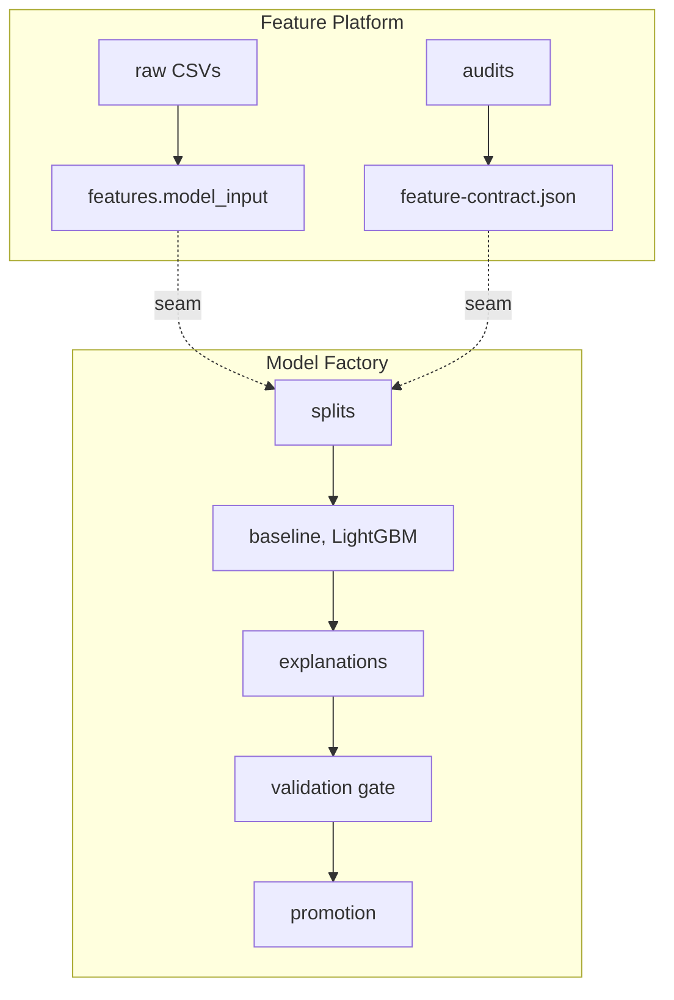

# Code structure

Three boundaries, and they are different questions with different answers: which
*language* a piece of work is written in, which code a notebook may import, and which
code may be deployed apart from what.

## 1. The language seam

```text
analysis/            R      every audit, and the descriptive pass
   ↓ fragments (JSON) + declaration
src/fraud_detection/ Python  the model lifecycle
```

The split is not by preference. Everything that decides **what is true of the data** is a
statistical question and lives in R: rank statistics with confidence intervals,
weight-of-evidence tables, permutation and two-sample tests, each with its own `testthat`
suite and a `targets` graph. Everything that decides **what happens to a model** is
Python: features in SQL, training, the promotion gate, serving.

Exactly one artefact crosses, in one direction. The audits write contract fragments;
`uv run stamp-contract` merges them, applies the admission policy and stamps a
fingerprint into `references/feature-contract.json`. Nothing in `analysis/` imports
Python and nothing in `src/` imports R.

| | `analysis/` (R) | `src/fraud_detection/` (Python) |
| --- | --- | --- |
| Answers | is this column trustworthy | what is done with the trustworthy ones |
| Output | contract fragments, tables, Quarto reports | a trained, gated, promoted model |
| Runs | on a parquet export, in minutes, no cloud | BigQuery, Dagster, Vertex, Cloud Run |
| Tested by | `testthat` | `pytest` |
| Depends on the other | no | only on the stamped JSON file |

Why the fingerprint is stamped on the Python side is in
[`contract/stamp.py`](../src/fraud_detection/contract/stamp.py): `FeatureContract.from_dict`
refuses a file whose stored hash disagrees with its contents, and that detector must not
depend on two JSON serialisers agreeing forever. One writer, one hash.

What R needs from Python is the frame *as the model receives it* — the model input with
the declared derivations already applied, which `uv run export-audit-frame` produces.
Auditing the raw export instead would leave the thirty derived columns unexamined.

## 2. The import rule

Inside the Python half:

```text
src/fraud_detection/
    config.py              every setting, read from config/*.toml
    schema.py              the shared vocabulary: tables, columns, entity components
    contract/              the feature contract, and the command that stamps it
    features/              SQL derivations, row-local features, the entity key
    training/              the modelling recipe            the pure layer: polars, numpy,
    registry/              promotion marker, provenance    sklearn, lightgbm — and no
    ---------------------------------------------------  Dagster, no cloud SDK
    tools/                 hand-run commands that reach BigQuery or GCS
    serving/               /predict, /health, and the batch scoring job
    orchestration/         Dagster assets, resources, catalog labels
```

Above the line is the **pure layer**. It may not import `dagster` or `google`, and it may
not import anything from below the line. Below the line, anything may import anything —
`serving/batch.py` reaches into `orchestration.resources` to build the same clients the
graph builds, and that is allowed precisely because it is below the line.

`tools/` exists because of that line rather than in spite of it. `noise_band` is about
training and `frequency_maps` is about features, but both open a BigQuery client — so
putting either in the package it is *about* would drag a cloud SDK into every notebook
that touched that package. The criterion is **"reaches outside the process"**, and it is
checked: [`tests/test_layering.py`](../tests/test_layering.py) asserts both that `tools/`
really does hold such modules and that nothing in the pure layer imports them.

The tests read the import graph with `ast` and check each direction per module, so the
rule is enforced rather than described. They also assert that the package root
`__init__.py` imports nothing: it used to import `definitions`, which cost three seconds
and 3,500 modules before a notebook could call a pandas function.

What the rule buys:

- One definition of each transformation. A pure function is called by the pipeline, by an
  analysis and by the scoring path. Welded into a Dagster asset it would have to be
  reimplemented by whoever else needed it, and two implementations of one feature drift
  apart within weeks.
- Tests run without credentials, because the logic under test constructs no cloud clients.
- The portability claim in [architecture.md](architecture.md) stays checkable.

## 3. The deployment boundary

[`orchestration/definitions/`](../src/fraud_detection/orchestration/definitions/) holds three
Dagster code locations, loaded as separate processes from one `workspace.yaml`. The seam that
matters is between the first two; `inference` consumes `model_input` and the promotion marker
and builds nothing either of them needs.



Exactly two artefacts cross, and
[`model_factory.py`](../src/fraud_detection/orchestration/definitions/model_factory.py)
declares both in `EXTERNAL_ASSETS`:

| Crossing | How it is consumed |
| --- | --- |
| `model_input` | Depended on by key, never by value. The table name comes from `schema.qualified(...)`, a constant both sides share. |
| `feature_contract` | Read from `references/feature-contract.json`, with the fingerprint pinned onto the trained model. |

The by-key rule is what makes the boundary real. Passing a table name down the graph as a
return value works inside one location and is impossible across two, so an asset that still
takes `model_input: str` has not actually crossed anything. That is why `split_assignment`,
`bqml_baseline`, `lightgbm_model` and `model_explanations` take `deps=[AssetKey("model_input")]`.

[`tests/test_code_locations.py`](../tests/test_code_locations.py) checks the seam: that the
crossing is exactly those two keys, that the platform builds what the factory declares, that
neither location's module imports the other, and that no asset is built twice.

## 4. Where the code runs

The import graph says nothing about where work happens.

| Stage | Runs |
| --- | --- |
| Ingestion, join, feature engineering, model input, splits | BigQuery, one statement each; the result never leaves the warehouse |
| Feature audits (`analysis/`) | Locally, in R, on a parquet export. Not a Dagster stage at all: `orchestration/assets/feature_audit.py` only reads the stamped contract and refuses a stale one. |
| Training (`orchestration/assets/training.py`) | Locally, in the Dagster process |
| Scoring windows and test model input | BigQuery, over `raw.scoring_history` (train ∪ test) |
| Batch scoring (`orchestration/assets/inference.py`) | Cloud Run Job, from the image this repository builds |

Training is local because LightGBM cannot be expressed in SQL, and it pulls a few hundred
MB into the process. That is the reason "where does Dagster run" is still an open question
rather than a settled one — and it is now the *only* such stage, because the audits left
the orchestrator with the data they used to load.

## 5. What each directory is, in the usual vocabulary

The boxes are from Sculley et al., *Hidden Technical Debt in Machine Learning Systems*
(NeurIPS 2015) — the paper whose point is that the ML code is the small box in the middle.
This repository is mostly the other boxes, and naming them is what stops a directory
called `core/` from accumulating whatever had no obvious home.

| Box | Here |
| --- | --- |
| Configuration | [`config.py`](../src/fraud_detection/config.py), `config/*.toml` |
| Data collection | [`orchestration/raw_load.py`](../src/fraud_detection/orchestration/raw_load.py), `kaggle/`, `schemas/` |
| Data verification | [`analysis/`](../analysis/README.md) — every audit, in R — and [`contract/`](../src/fraud_detection/contract/), which turns its verdicts into one admitted list |
| Feature extraction | [`features/`](../src/fraud_detection/features/) |
| ML code | [`training/`](../src/fraud_detection/training/) |
| Analysis tools | [`analysis/notebooks/`](../analysis/README.md), [`tools/noise_band.py`](../src/fraud_detection/tools/noise_band.py), `training/plots.py` |
| Process management | [`orchestration/`](../src/fraud_detection/orchestration/) (Dagster), [`registry/`](../src/fraud_detection/registry/) |
| Serving infrastructure | [`serving/`](../src/fraud_detection/serving/) |
| Machine resource management | [`iaac/`](../iaac/README.md), `Dockerfile` |
| Monitoring | **absent.** `inference.prediction_logs` records what a monitor would read and nothing reads it on a schedule. The statistics a drift monitor needs already exist in [`analysis/R/distribution_shift.R`](../analysis/R/distribution_shift.R) — the same PSI against the same measured null — so what is missing is a cadence and somebody to alert, not a method. See [architecture.md](architecture.md). |

The mapping is one-to-one on purpose. A directory that answers to two boxes is a directory
whose name cannot tell you what belongs in it, which is how the previous `core/` came to
hold configuration, a data contract, a schema, a promotion marker and a provenance record
at the same time.
