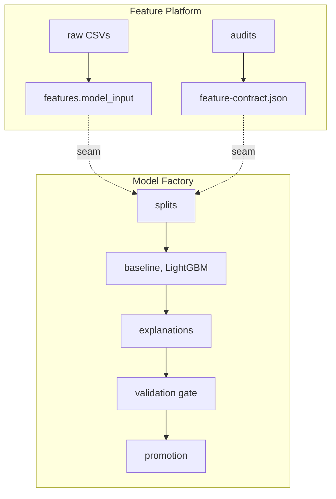

# Code structure

Two boundaries: which code a notebook may import, and which code may be deployed apart from
what. They are different questions with different answers.

## 1. The import rule

```text
src/fraud_detection/
    core/                  schema, config, promotion marker, provenance, feature contract
    evaluation/            the six feature audits          pure: pandas, numpy, sklearn,
    feature_engineering/   SQL derivations, row-local FE   lightgbm. No Dagster, no cloud SDK
    training/              the modelling recipe

    orchestration/         assets, resources, definitions, catalog labels
    serving/               FastAPI surface for the registry's container contract
    cli/                   score-batch, noise-band, build-frequency-maps
```

`orchestration/` may import from anywhere. Nothing may import from `orchestration/`, and
nothing in the pure layer may import `dagster` or `google`.

[`tests/test_layering.py`](../tests/test_layering.py) reads the import graph with `ast` and
checks both directions per module, so the rule is enforced rather than described. It also
asserts that the package root `__init__.py` imports nothing: it used to import `definitions`,
which cost three seconds and 3,500 modules before a notebook could call a pandas function.

What the rule buys:

- One definition of each transformation. A pure function is called by the pipeline, the
  notebooks and the scoring path. Welded into a Dagster asset, it would have to be
  reimplemented by whoever else needed it, and two implementations of one feature drift apart
  within weeks.
- Tests run without credentials, because the logic under test constructs no cloud clients.
- The portability claim in [architecture.md](architecture.md) stays checkable.

## 2. The deployment boundary

[`orchestration/definitions/`](../src/fraud_detection/orchestration/definitions/) holds three
Dagster code locations, loaded as separate processes from one `workspace.yaml`. The seam that
matters is between the first two; `inference` consumes `model_input` and the promotion marker
and builds nothing either of them needs.



Exactly two artefacts cross, and
[`model_factory.py`](../src/fraud_detection/orchestration/definitions/model_factory.py)
declares both in `EXTERNAL_ASSETS`:

| Crossing | How it is consumed |
| --- | --- |
| `model_input` | Depended on by key, never by value. The table name comes from `schema.qualified(...)`, a constant both sides share. |
| `feature_contract` | Read from `references/feature-contract.json`, with the fingerprint pinned onto the trained model. |

The by-key rule is what makes the boundary real. Passing a table name down the graph as a
return value works inside one location and is impossible across two, so an asset that still
takes `model_input: str` has not actually crossed anything. That is why `split_assignment`,
`bqml_baseline`, `lightgbm_model` and `model_explanations` take `deps=[AssetKey("model_input")]`.

[`tests/test_code_locations.py`](../tests/test_code_locations.py) checks the seam: that the
crossing is exactly those two keys, that the platform builds what the factory declares, that
neither location's module imports the other, and that no asset is built twice.

## 3. Where the code runs

The import graph says nothing about where work happens.

| Stage | Runs |
| --- | --- |
| Ingestion, join, feature engineering, model input, splits | BigQuery, one statement each; the result never leaves the warehouse |
| Feature audits (`orchestration/assets/feature_audit.py`) | Locally, in the Dagster process |
| Training (`orchestration/assets/training.py`) | Locally, in the Dagster process |
| Scoring windows and test model input | BigQuery, over `raw.scoring_history` (train ∪ test) |
| Batch scoring (`orchestration/assets/inference.py`) | Cloud Run Job, from the image this repository builds |

The two local stages are bounded: LightGBM cannot be expressed in SQL, and each pulls a few
hundred MB into the process. They are also the reason "where does Dagster run" is still an
open question rather than a settled one.
