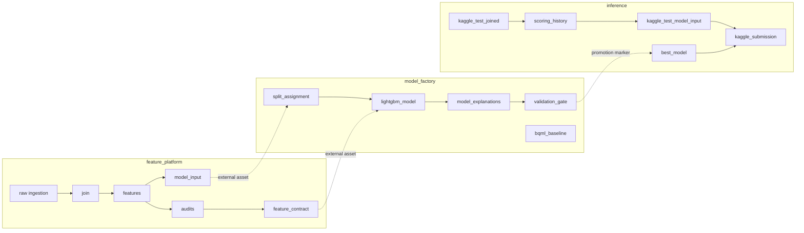
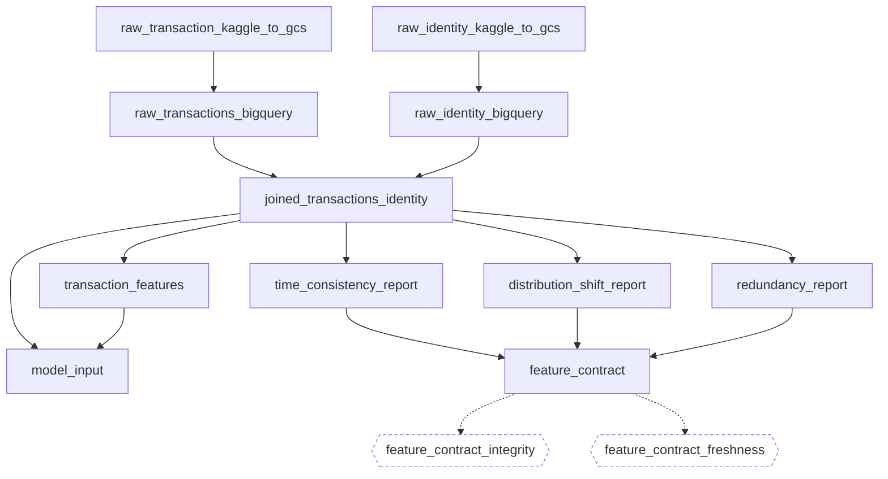

# Orchestration

How this pipeline is laid out in Dagster: what the code locations are, which assets live in
which group, what the jobs and checks do, and — at the end — which Dagster features are
deliberately **not** used, with the reason.

> The last section is the point of this document. Using every feature a framework offers is
> not the same as using it well, and a pipeline that adopts partitions because partitions
> exist is worse than one that explains why it has none.

---

## 1. Three code locations

`dagster/workspace.yaml` loads three independent `Definitions`. They are separate processes
with separate dependency sets, and each answers to a different owner in a real team.

The dotted edges cross locations. Dagster models them as `AssetSpec` stubs — a location
declares the _key_ it depends on without importing the code that produces it, so the graph
is complete in the UI while the processes stay independent. That is what makes the split
real rather than cosmetic.

**Why three and not one:** the feature platform runs when the _data_ changes, the model
factory when the _recipe_ changes, and inference when a _model is promoted_. Three different
triggers, three different cadences, three different failure blast radii.

## 2. Asset groups

Groups are the unit the catalog is browsed by, so they follow the lifecycle rather than the
module layout.

| Group                 | Assets | What it owns                                                    |
| --------------------- | -----: | --------------------------------------------------------------- |
| `dataset_preparation` |      1 | Staging the Kaggle CSV into GCS — manual, the dataset is static |
| `raw_ingestion`       |      7 | CSV → BigQuery under a pinned schema, train and test            |
| `feature_store`       |      2 | The join, the point-in-time feature SQL, and `model_input`      |
| `feature_audit`       |      4 | The audits and the contract they merge into                     |
| `model_training`      |      2 | The BQML baseline and the LightGBM model                        |
| `model_registry`      |      2 | Explainability and the promotion gate                           |
| `batch_inference`     |      4 | Scoring history, model input, submission, prediction logs       |
| `model_serving`       |      1 | Loading the promoted artifact                                   |

## 3. The feature platform, in detail

The three audits write BigQuery tables; `feature_contract` reads them, merges the fragments,
adds the two audits that need no table of their own, and writes
`references/feature-contract.json` — **committed to the repository**, so a change to the
admitted feature set arrives as a reviewable diff rather than as a silent shift in what the
model sees.

## 4. Jobs and automation

One job per code location, selecting everything in it:

| Location           | Job                    | Trigger                                     |
| ------------------ | ---------------------- | ------------------------------------------- |
| `feature_platform` | `feature_platform_job` | `0 0 * * *`                                 |
| `model_factory`    | `model_factory_job`    | `AutomationCondition.eager()` on its assets |
| `inference`        | `inference_job`        | `AutomationCondition.eager()` on its assets |

**Only ingestion is on a clock, and that is the one place a clock is right:** nothing
upstream of it is an asset, so "has the source moved?" can only be answered by looking.

Everything downstream is declarative. A 04:00 cron would retrain on whatever the contract
happened to be at 04:00 — including a contract that did not change, and one that failed its
checks. Scoring is sharper still: it should happen **because a model was promoted**, which is
a dependency already in the graph. A morning cron would score with whatever the marker
pointed at, and on a day training failed the scoring path would refuse — correctly — leaving
a red run every morning that meant nothing.

Dagster is not hosted here, so neither the cron nor the conditions fire unattended;
`architecture.md` argues that hosting it is a cloud bill rather than a demonstration.

The Cloud Run Job invokes `inference_job` directly with `dagster job execute`, which is why
the job exists as a named object rather than only as a UI convenience.

## 5. Asset checks

Checks are separate from assets on purpose: a check that fails does not necessarily mean the
asset failed to materialize, and Dagster models that distinction.

| Check                           | On                 | Fails when                                                              |
| ------------------------------- | ------------------ | ----------------------------------------------------------------------- |
| `feature_contract_integrity`    | `feature_contract` | The file's own hash disagrees with its contents — it was hand-edited    |
| `feature_contract_freshness`    | `feature_contract` | The contract is older than the policy's `max_staleness_days`            |
| `model_features_admitted_check` | `lightgbm_model`   | The model was fitted on a column the contract does not admit            |
| `test_pr_auc_threshold_check`   | `lightgbm_model`   | Test PR-AUC falls below the configured floor                            |
| `schema_valid`                  | ingestion assets   | A required column is missing, or `isFraud` holds a value outside {0, 1} |

`schema_valid` is declared with `AssetCheckSpec` and yielded from inside the asset, because
it has to run **before** the load and abort it. The others are `@asset_check` functions that
run after their asset.

The five promotion checks are _not_ Dagster checks — they live inside `validation_gate` and
raise `Failure`, because their job is to stop the promotion, not to annotate it.

## 6. Resources and IO

| Resource                                                | Purpose                                                                                    |
| ------------------------------------------------------- | ------------------------------------------------------------------------------------------ |
| `BigQueryResource`                                      | Client and project, one place                                                              |
| `ModelArtifactStore`                                    | The GCS bucket models and markers live in                                                  |
| `ExperimentTracker`                                     | Vertex AI Experiments — one tracker, so there is never a second place to look for a number |
| `RawCsvSourceResource` / `IdentityRawCsvSourceResource` | Where the CSV comes from; defaults to the committed sample so tests need no cloud          |
| `KaggleRawDumpResource`                                 | The competition download                                                                   |

One custom IO manager, `gcs_model_io_manager`, on `lightgbm_model`: the trained bundle is a
pickle in GCS rather than a Dagster-managed local file, because the Cloud Run Job has to read
it from outside Dagster entirely.

Every other asset returns a **table name**, not data. The frames never pass through the
orchestrator's memory — BigQuery does the work and the asset records where the result landed.

## 7. Metadata

Every materialization carries metadata into the catalog: row counts, the contract
fingerprint, the code version, artifact URIs, plot URIs, and — for the audits — how far each
check's own verdicts reproduce. `MaterializeResult(metadata=…)` is used in preference to
bare returns wherever there is something worth recording.

The one that matters most is on `feature_contract`: it carries `admitted`, `rejected`,
`overridden` and the fingerprint, so the catalog answers "what changed about the feature set,
and when" without opening the JSON.

---

## 8. What is deliberately not used

| Feature               | Why not                                                                                                                                                                                                                                                                                                                                                                                                  |
| --------------------- | -------------------------------------------------------------------------------------------------------------------------------------------------------------------------------------------------------------------------------------------------------------------------------------------------------------------------------------------------------------------------------------------------------- |
| **Partitions**        | The obvious candidate — this is time-series data — and the wrong tool here. The dataset is a fixed historical file that is loaded once; partitions exist to materialize slices independently and to backfill, and there is nothing to backfill. Adding them would produce a prettier UI over a single static partition. **This is the one to revisit first** if the pipeline ever ingested a daily feed. |
| **Sensors**           | A sensor watches for an external event. Every trigger here is either a schedule or a human deciding to retrain; inventing a sensor to poll a static bucket would be machinery without a signal.                                                                                                                                                                                                          |
| **Backfill policies** | Follows from having no partitions.                                                                                                                                                                                                                                                                                                                                                                       |
| **`FreshnessPolicy`** | The contract's staleness is already enforced by `feature_contract_freshness`, which reads the policy's own `max_staleness_days` — putting the same rule in two places is how two rules drift apart.                                                                                                                                                                                                      |
| **`RetryPolicy`**     | The expensive steps are BigQuery jobs, which the client already retries. A Dagster-level retry on a training step would silently re-run a 10-minute fit on a transient error nobody saw.                                                                                                                                                                                                                 |

## 9. Catalog affordances

`orchestration/catalog.py` holds the labels that make the graph readable without changing what runs: `kinds` (which engine — BigQuery, LightGBM, GCS, Vertex), `owners` (the code location responsible, as a team handle rather than a person, because this is a single-operator project and thirty personal owners would be noise), and `code_version`.

`code_version` is the repository's git SHA rather than a per-asset hash. That is the right granularity **here specifically**: `config/*.toml` is read at import time by nearly every asset, so a commit that only edits a threshold really can change what any of them produces.
In a repository where assets had independent inputs it would over-invalidate.

### Column-level lineage

`orchestration/contract_catalog.py` translates the feature contract into `TableSchema` and `TableColumnLineage`, attached to the `feature_contract` asset. The contract has always recorded which columns reach the model and which audit rejected the rest; this expresses the same record in the shape Dagster renders, so the catalog answers **"why is this column not in
the model"** without anyone opening the JSON.

Rejected columns are listed rather than omitted, with their rejecting check and its number — a schema showing only survivors could not answer that question at all.

## 10. What is missing

Nothing structural. The one thing worth naming is that **the schedules and the automation conditions have never run against each other in anger**, because Dagster is not hosted here.
`AutomationCondition.eager()` is the correct expression of the dependency and its behaviour
under a real daemon — how it interacts with a failed upstream, how it backs off — is
untested in this repository.
