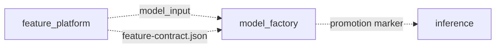

# Orchestration

The Dagster layout: code locations, asset groups, jobs, checks, and the framework features
that are deliberately unused.

## 1. Three code locations

`dagster/workspace.yaml` loads three independent `Definitions` as separate processes with
separate dependency sets.

The dotted edges cross locations. Dagster models them as `AssetSpec` stubs: a location
declares the key it depends on without importing the code that produces it, so the graph is
complete in the UI while the processes stay independent. No job renders those edges, because
each job runs inside one location, which is why they are drawn here and nowhere below.

What each location actually contains, exported from a running instance rather than drawn by
hand:

| Job | Scope | Graph |
| --- | --- | --- |
| `feature_platform_job` | Raw CSV to a committed feature contract, with the audits behind it |  |
| `model_factory_job` | Splits, baseline, training, explanations, promotion gate |  |
| `inference_job` | The scoring path, run to completion by a Cloud Run Job |  |

The group boxes in those renderings are §2 and the engine badges are the `kinds` labels from
§6.

The split follows the trigger. The feature platform runs when the data changes, the model
factory when the recipe changes, and inference when a model is promoted. Three cadences, three
blast radii. The seam is checked by a test rather than described by this diagram, see
[code-structure.md](code-structure.md).

## 2. Asset groups

Groups follow the lifecycle rather than the module layout, because the catalog is browsed by
group.

| Group | Assets | Location | Owns |
| --- | ---: | --- | --- |
| `raw_ingestion` | 7 | feature_platform | Kaggle staging, CSV to BigQuery under a pinned schema, the join |
| `feature_store` | 2 | feature_platform | The point-in-time feature SQL and `model_input` |
| `feature_audit` | 4 | feature_platform | The three audit reports and the contract they merge into |
| `dataset_preparation` | 1 | model_factory | The time-based split assignment |
| `model_training` | 2 | model_factory | The BQML baseline and the LightGBM model |
| `model_registry` | 2 | model_factory | Explanations and the promotion gate |
| `model_serving` | 1 | inference | Loading the promoted artifact |
| `batch_inference` | 4 | inference | Scoring history, test model input, submission, prediction logs |

## 3. Jobs and automation

One job per code location, selecting everything in it.

| Location | Job | Trigger |
| --- | --- | --- |
| `feature_platform` | `feature_platform_job` | `ScheduleDefinition`, `0 0 * * *` |
| `model_factory` | `model_factory_job` | `AutomationCondition.eager()` on its assets |
| `inference` | `inference_job` | `AutomationCondition.eager()` on its assets |

Only ingestion is on a clock, because nothing upstream of it is an asset and "has the source
moved?" can only be answered by looking. Everything downstream is declarative: a 04:00 cron
would retrain on whatever the contract happened to be at 04:00, including a contract that did
not change and one that failed its checks. Scoring is sharper still, since it should happen
because a model was promoted, which is already an edge in the graph. A morning cron would
score with whatever the marker pointed at, and on a day training failed the scoring path would
refuse, correctly, leaving a red run every morning that meant nothing.

Dagster is not hosted here, so neither the schedule nor the conditions fire unattended.

The Cloud Run Job invokes `inference_job` with `dagster job execute`, which is why the job
exists as a named object rather than only as a UI convenience.

## 4. Asset checks

| Check | On | Fails when |
| --- | --- | --- |
| `schema_valid` | ingestion assets | A required column is missing, or `isFraud` holds a value outside {0, 1} |
| `feature_contract_integrity` | `feature_contract` | The file's own hash disagrees with its contents, meaning it was hand-edited |
| `feature_contract_freshness` | `feature_contract` | The contract is older than the policy's `max_staleness_days` |
| `model_features_admitted_check` | `lightgbm_model` | The model was fitted on a column the contract does not admit |
| `test_pr_auc_threshold_check` | `lightgbm_model` | Test PR-AUC falls below the configured floor |

`schema_valid` is declared with `AssetCheckSpec` and yielded from inside the asset, because it
has to run before the load and abort it. The others are `@asset_check` functions that run
after their asset.

The five promotion checks are not Dagster checks. They live inside `validation_gate` and raise
`Failure`, because their job is to stop the promotion rather than annotate it.

## 5. Resources and IO

| Resource | Purpose |
| --- | --- |
| `BigQueryResource` | Client and project in one place |
| `ModelArtifactStore` | The GCS bucket holding models and the promotion marker |
| `ExperimentTracker` | Vertex AI Experiments, one tracker so there is never a second place to look for a number |
| `RawCsvSourceResource`, `IdentityRawCsvSourceResource` | Where the CSV comes from; defaults to the committed sample so tests need no cloud |
| `KaggleRawDumpResource`, `KaggleIdentityRawDumpResource` | The competition download |

One custom IO manager, `gcs_model_io_manager`, on `lightgbm_model`: the trained bundle is a
pickle in GCS rather than a Dagster-managed local file, because the Cloud Run Job reads it
from outside Dagster.

Every other asset returns a table name rather than data. The frames never pass through the
orchestrator's memory.

## 6. Metadata

Materializations carry row counts, the contract fingerprint, the code version, artifact and
plot URIs, and for the audits, how far each check's verdicts reproduce.

The one that earns its place is on `feature_contract`: `admitted`, `rejected`, `overridden` and
the fingerprint, so the catalog answers what changed about the feature set and when without
anyone opening the JSON.

`orchestration/catalog.py` holds the labels that make the graph readable without changing what
runs: `kinds` (BigQuery, LightGBM, GCS, Vertex), `owners` (the responsible code location as a
team handle, since this is a single-operator project and thirty personal owners would be
noise), and `code_version`.

`code_version` is the repository's git SHA rather than a per-asset hash. That is the right
granularity here specifically, because `config/*.toml` is read at import time by nearly every
asset, so a commit that only edits a threshold really can change what any of them produces. In
a repository where assets had independent inputs it would over-invalidate.

`orchestration/contract_catalog.py` translates the contract into `TableSchema` and
`TableColumnLineage` on the `feature_contract` asset, listing rejected columns with their
rejecting check and its number rather than omitting them. A schema showing only survivors could
not answer why a column is missing from the model.

## 7. Deliberately unused

| Feature | Why not |
| --- | --- |
| Partitions | The obvious candidate for time-series data and the wrong tool here. The dataset is a fixed historical file loaded once; partitions exist to materialize slices independently and to backfill, and there is nothing to backfill. This is the first thing to revisit if the pipeline ever ingested a daily feed. |
| Sensors | A sensor watches for an external event. Every trigger here is a schedule or a person deciding to retrain, so a sensor polling a static bucket would be machinery without a signal. |
| Backfill policies | Follows from having no partitions. |
| `FreshnessPolicy` | Contract staleness is already enforced by `feature_contract_freshness`, which reads the policy's own `max_staleness_days`. The same rule in two places is how two rules drift apart. |
| `RetryPolicy` | The expensive steps are BigQuery jobs, which the client already retries. A Dagster-level retry on training would silently re-run a ten-minute fit on a transient error nobody saw. |

## 8. Known gap

The schedule and the automation conditions have never run against each other under a daemon,
because Dagster is not hosted here. `AutomationCondition.eager()` is the correct expression of
the dependency; how it behaves with a failed upstream, and how it backs off, is untested in
this repository.
