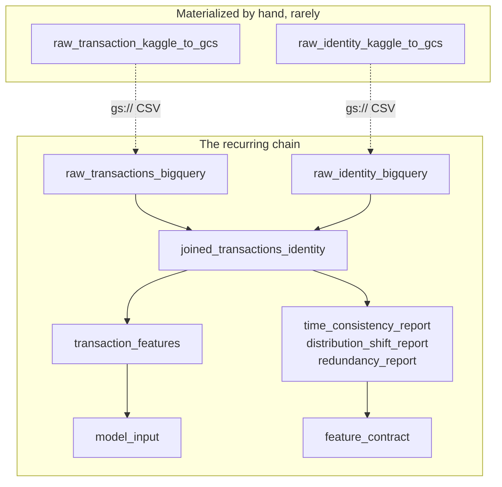

# Local setup and runbook

Running the pipeline on your own machine against your own GCP project. What the pipeline is
and why it looks this way: [architecture.md](architecture.md).

`<your-project-id>` means your GCP project ID throughout.

## Prerequisites

- [`uv`](https://docs.astral.sh/uv/) for the Python environment
- `gcloud`, authenticated
- A GCP project with the infrastructure applied, see [`iaac/README.md`](../iaac/README.md)
- A Kaggle account with access to the
  [IEEE-CIS Fraud Detection](https://www.kaggle.com/c/ieee-fraud-detection) competition

## 1. Python environment

```bash
uv venv
source .venv/bin/activate
uv sync
```

```bash
uv run ruff check . && uv run pytest
```

Neither needs cloud access. One ingestion test expects a local sample CSV, see §5.

## 2. Environment variables

```bash
cp .env.example .env
```

Then edit the absolute paths inside. `uv run` reads `.env` automatically.

| Variable | Purpose |
| --- | --- |
| `DAGSTER_HOME` | Dagster runtime state. Must point outside `dagster/`, which holds only tracked config. |
| `PYTHONPATH` | `<repo>/src`, so `fraud_detection` imports without being installed |
| `GOOGLE_APPLICATION_CREDENTIALS` | ADC file for this project's service account (step 3). Keep it outside any repo. |
| `KAGGLE_USERNAME`, `KAGGLE_KEY` | Legacy Kaggle API key, if not using `~/.kaggle/kaggle.json` |
| `GCP_PROJECT_ID` | Your GCP project ID |

## 3. GCP authentication

Local runs authenticate as the project's service account by impersonation, so no long-lived
key file exists on disk.

Once, grant yourself the right to impersonate it:

```bash
gcloud iam service-accounts add-iam-policy-binding \
  fraud-mlops-sa-dev@<your-project-id>.iam.gserviceaccount.com \
  --member="user:$(gcloud config get-value account)" \
  --role="roles/iam.serviceAccountTokenCreator"
```

Then mint the credentials:

```bash
gcloud auth application-default login \
  --impersonate-service-account=fraud-mlops-sa-dev@<your-project-id>.iam.gserviceaccount.com

mkdir -p "$(dirname "$(grep GOOGLE_APPLICATION_CREDENTIALS .env | cut -d= -f2)")"
cp ~/.config/gcloud/application_default_credentials.json \
   "$(grep GOOGLE_APPLICATION_CREDENTIALS .env | cut -d= -f2)"
```

The copy matters: the global ADC file is overwritten by whatever GCP project you authenticate
against next, so pointing `GOOGLE_APPLICATION_CREDENTIALS` at a private copy keeps this
project's credentials stable.

## 4. Dagster

`dagster/` holds tracked config only (`dagster.yaml`, `workspace.yaml`). Runtime state, run
and event history and compute logs live in `.dagster_home/`, which is gitignored and must not
be the same directory.

```bash
mkdir -p .dagster_home
ln -s ../dagster/dagster.yaml .dagster_home/dagster.yaml
uv run dagster dev -w dagster/workspace.yaml -p 3000
```

## 5. Data

Raw data is never committed, competition terms included. `RawCsvSourceResource` defaults to
`data/raw/train_transaction_sample.csv`, which one ingestion test also reads, so create it
from your own Kaggle download (the header plus a few hundred rows is enough). The pipeline
itself reads the full dataset from a `gs://` URI.

### Ad hoc local copy, for notebooks

```bash
uv tool install kaggle
mkdir -p ~/.kaggle           # place kaggle.json here, then:
chmod 600 ~/.kaggle/kaggle.json

mkdir -p data/raw
kaggle competitions download -c ieee-fraud-detection -p data/raw
unzip data/raw/ieee-fraud-detection.zip -d data/raw
```

### Staging into GCS, the pipeline path

`raw_transaction_kaggle_to_gcs` and `raw_identity_kaggle_to_gcs` download from Kaggle and
stream to GCS without the payload passing through the process. They are not wired as
dependencies of the load assets: the dataset is static, so making them upstream would
re-download hundreds of megabytes on every ingestion run to produce a byte-identical file.
Materialize them by hand when the staged files need reseeding.

```bash
uv run --env-file .env dagster asset materialize \
  -m fraud_detection.orchestration.definitions.feature_platform \
  --select raw_transaction_kaggle_to_gcs,raw_identity_kaggle_to_gcs
```

Kaggle auth accepts either form; `KaggleApi.authenticate()` checks both:

```bash
kaggle auth login    # or place a legacy key at ~/.kaggle/kaggle.json, or set KAGGLE_* in .env
```

### Pointing the pipeline at the staged file

`RawCsvSourceResource` defaults to the committed sample. The wired definitions in
[`orchestration/definitions/feature_platform.py`](../src/fraud_detection/orchestration/definitions/feature_platform.py)
override both source resources with `RAW_DUMP_GCS_URI` and `IDENTITY_RAW_DUMP_GCS_URI`, the
constants in
[`orchestration/resources.py`](../src/fraud_detection/orchestration/resources.py). There is no
committed identity sample, so instantiating `IdentityRawCsvSourceResource` bare, outside the
wired definitions, fails loudly rather than skipping.

For a one-off run against a different file, override `uri` via run config.

## 6. Running the pipeline

```bash
# feature platform: ingestion, join, features, model input, audits, contract
uv run dagster asset materialize \
  -m fraud_detection.orchestration.definitions.feature_platform --select <asset>

# model factory: splits, baseline, training, explanations, gate
uv run dagster asset materialize \
  -m fraud_detection.orchestration.definitions.model_factory --select <asset>

# inference: scoring history, test model input, submission, prediction logs
uv run dagster asset materialize \
  -m fraud_detection.orchestration.definitions.inference --select <asset>
```

### The feature platform graph

Solid arrows are Dagster dependencies: materialize the last asset and everything upstream
runs. The staging assets are handoffs Dagster does not model, since they write a file that a
later run reads.



| Asset | What it does |
| --- | --- |
| `raw_transaction_kaggle_to_gcs`, `raw_identity_kaggle_to_gcs` | Download from Kaggle, unwrap the zip if present, stream to GCS |
| `raw_transactions_bigquery`, `raw_identity_bigquery` | Load the raw tables with `WRITE_TRUNCATE` against the pinned schema in [`schemas/`](../schemas/). Yields a `schema_valid` check that runs before the load and aborts it: a missing required column, or `isFraud` outside {0, 1}, is a hard failure. |
| `raw_test_transaction_bigquery`, `raw_test_identity_bigquery` | The same for the competition test files, used by the inference location |
| `joined_transactions_identity` | Left join plus `null_count_V_block`, one `CREATE OR REPLACE TABLE … AS SELECT` |
| `transaction_features` | The point-in-time velocity features, one statement over the joined table |
| `model_input` | Raw columns plus the engineered ones, joined on `TransactionID` |
| `time_consistency_report`, `distribution_shift_report`, `redundancy_report` | The audits, into BigQuery tables |
| `feature_contract` | Merges the fragments and writes `references/feature-contract.json`. Commit the result. |

From a cold start: stage both files to GCS, then materialize `model_input` and let the chain
pull everything else.

`joined_transactions_identity` and everything below it need the real columns, which the
committed sample does not have, so the load assets must have loaded the full dataset from GCS
first.

## 7. Regenerating the contract

```bash
uv run dagster asset materialize \
  -m fraud_detection.orchestration.definitions.feature_platform \
  --select time_consistency_report,distribution_shift_report,redundancy_report,feature_contract
```

The time-consistency scan is about four minutes on eight cores. After a change to
[`config/feature-admission.toml`](../config/feature-admission.toml) that does not affect how
the reports were computed, materializing `feature_contract` alone reassembles from the
existing report tables in seconds. Commit the resulting JSON.
