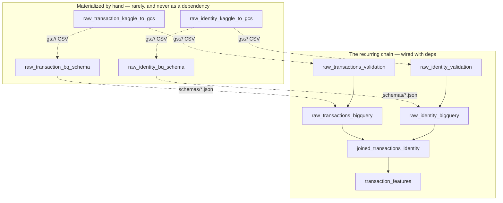

# Local Setup & Runbook

Everything needed to run the pipeline on your own machine against your own GCP project.
For what the pipeline is and why it looks this way, see [architecture.md](architecture.md).

Throughout, `<your-project-id>` means your GCP project ID and `<your-raw-bucket>` the GCS
bucket created by the Terraform in [`iaac/`](../iaac/README.md).

---

## Prerequisites

- [`uv`](https://docs.astral.sh/uv/) for Python environment and dependency management
- `gcloud` CLI, authenticated
- A GCP project with the infrastructure applied — see [`iaac/README.md`](../iaac/README.md)
  for backend bootstrap and `tofu apply`
- A Kaggle account with access to the
  [IEEE-CIS Fraud Detection](https://www.kaggle.com/c/ieee-fraud-detection) competition

---

## 1. Python environment

```bash
uv venv
source .venv/bin/activate
uv sync
```

Verify:

```bash
uv run ruff check .
uv run pytest
```

The test suite runs against the committed sample CSV and needs no cloud access.

---

## 2. Environment variables

```bash
cp .env.example .env
```

Then edit the absolute paths inside. `uv run` reads `.env` automatically.

| Variable | Purpose |
| --- | --- |
| `DAGSTER_HOME` | Dagster instance runtime state. Must point **outside** `dagster/`, which holds only tracked config. |
| `PYTHONPATH` | Set to `<repo>/src` so `fraud_detection` imports without being installed as a package. |
| `GOOGLE_APPLICATION_CREDENTIALS` | ADC file scoped to this project's service account (step 3). Keep it outside any repo. |
| `KAGGLE_USERNAME` | Legacy API key for Kaggle (if not using ~/.kaggle/kaggle.json). |
| `KAGGLE_KEY` | Legacy API key for Kaggle (if not using ~/.kaggle/kaggle.json). |
| `GCP_PROJECT_ID` | Your GCP project ID. |

---

## 3. GCP authentication

Local runs authenticate as the project's service account by impersonation, so no
long-lived key file ever exists on disk.

One time, grant yourself the right to impersonate it:

```bash
gcloud iam service-accounts add-iam-policy-binding \
  fraud-mlops-sa-dev@<your-project-id>.iam.gserviceaccount.com \
  --member="user:$(gcloud config get-value account)" \
  --role="roles/iam.serviceAccountTokenCreator"
```

Then mint the credentials:

```bash
gcloud auth application-default login \
  --impersonate-service-account=fraud-mlops-sa-dev@<your-project-id>.iam.gserviceaccount.com

mkdir -p "$(dirname "$(grep GOOGLE_APPLICATION_CREDENTIALS .env | cut -d= -f2)")"
cp ~/.config/gcloud/application_default_credentials.json \
   "$(grep GOOGLE_APPLICATION_CREDENTIALS .env | cut -d= -f2)"
```

The copy matters: the global ADC file gets overwritten by whatever other GCP project you
authenticate against next. Pointing `GOOGLE_APPLICATION_CREDENTIALS` at a private copy
keeps this project's credentials stable.

---

## 4. Dagster

`dagster/` holds only tracked config (`dagster.yaml`, `workspace.yaml`). All runtime state
— run and event history, compute logs — lives in `.dagster_home/`, which is gitignored and
must not be the same directory as `dagster/`.

One-time setup:

```bash
mkdir -p .dagster_home
ln -s ../dagster/dagster.yaml .dagster_home/dagster.yaml
```

Then, any time:

```bash
uv run dagster dev -w dagster/workspace.yaml -p 3000
```

---

## 5. Data

The repository ships a small sample CSV (`data/raw/train_transaction_sample.csv`) so tests
and the validation asset run out of the box. The real pipeline reads the full dataset from
a `gs://` URI. Raw data files are never committed.

### 5a. Ad hoc local copy (exploration only)

Not the pipeline path — this is for notebooks and poking around.

```bash
uv tool install kaggle
mkdir -p ~/.kaggle
# place kaggle.json in ~/.kaggle, then:
chmod 600 ~/.kaggle/kaggle.json

mkdir -p data/raw
kaggle competitions download -c ieee-fraud-detection -p data/raw
unzip data/raw/ieee-fraud-detection.zip -d data/raw
```

### 5b. Staging the full dataset into GCS (pipeline path)

Getting the full `train_transaction.csv` and `train_identity.csv` from Kaggle onto GCS is its own Dagster asset group.

These assets are deliberately **not** wired as a dependency of the validate and load assets: the
dataset is static, so making it upstream would re-download hundreds of megabytes on every
ingestion run to produce a byte-identical file. Materialize them by hand, rarely — whenever
the staged files need reseeding.

One-time Kaggle auth (either form works; `KaggleApi.authenticate()` checks both):

```bash
# Newer token-based auth
kaggle auth login
# -- or --
# Legacy API key: generate one at kaggle.com/settings, then either place it
# at ~/.kaggle/kaggle.json, or export KAGGLE_USERNAME / KAGGLE_KEY in .env
```

Then, from the Dagster UI, or:

```bash
uv run --env-file .env dagster asset materialize \
  -m fraud_detection.orchestration.definitions.feature_platform --select raw_transaction_kaggle_to_gcs \
  --select raw_identity_kaggle_to_gcs
```

### 5c. Point the pipeline at the staged file

Once staging succeeds, switch `raw_csv_source` and `identity_raw_csv_source` off the committed sample — either edit
the default resource URIs in [definitions/feature_platform.py](../src/fraud_detection/definitions/feature_platform.py) to point at `RAW_DUMP_GCS_URI` and `IDENTITY_RAW_DUMP_GCS_URI`
(the constants live in [resources.py](../src/fraud_detection/resources.py)), or override `uri` via run config for
a one-off materialization.

---

## 6. Running the pipeline

```bash
# feature platform assets (ingestion, features, audits, contract)
uv run dagster asset materialize -m fraud_detection.orchestration.definitions.feature_platform --select <asset>

# model factory assets (splits, baseline, training, gate)
uv run dagster asset materialize -m fraud_detection.orchestration.definitions.model_factory --select <asset>
```

### The asset graph

Ten assets in three groups. **Solid arrows are real Dagster dependencies** — materialize
the last asset and everything upstream of it runs. **Dotted arrows are handoffs Dagster
does not know about**: one asset writes a file, another reads it on a later run.



**Why the top four are not wired in:** The IEEE-CIS dataset is static. Making Kaggle staging assets downstream dependencies would re-download gigabytes on every ingestion run. Run them once by hand.

**Order of operations from a cold start:** stage both files to GCS → generate both schemas
and commit the JSON → then materialize `transaction_features` and let the chain pull
everything else.

### What each asset does

| Asset | What it does |
| --- | --- |
| `raw_transaction_kaggle_to_gcs`<br/>`raw_identity_kaggle_to_gcs` | Downloads the CSV from Kaggle (unwrapping Kaggle's zip if it appears) and streams it to GCS. The payload never passes through this process's memory. |
| `raw_transaction_bq_schema`<br/>`raw_identity_bq_schema` | Loads the full staged file into a throwaway sandbox table with autodetect, captures the resulting schema to `schemas/*.json`, drops the sandbox. The schema is proven against every row, not a sample. Rare, by-hand — **commit the JSON afterwards**. |
| `raw_transactions_validation`<br/>`raw_identity_validation` | Streams only the contract-critical columns across the whole file: `TransactionID`/`TransactionDT`/`TransactionAmt` plus `isFraud ⊆ {0,1}` for transactions, `TransactionID` and `DeviceInfo` for identity. A missing file or column is a hard failure, never a skip. |
| `raw_transactions_bigquery`<br/>`raw_identity_bigquery` | Loads the raw tables (`WRITE_TRUNCATE`). From a `gs://` source the bytes never pass through this process. |
| `joined_transactions_identity` | Left-joins the transaction and identity tables and engineers `null_count_V_block` from the raw nulls. One BigQuery `CREATE OR REPLACE TABLE … AS SELECT`; creates `ieee_train_joined`. |
| `transaction_features` | Builds point-in-time card/device velocity features into `features.transaction_features`. Runs as a single BigQuery `CREATE OR REPLACE TABLE … AS SELECT` on top of the joined table. |

`transaction_features` and `joined_transactions_identity` need the real columns, which the committed
sample does not contain — so the `bigquery` load assets must have loaded the **full**
dataset from GCS first, not the sample.

There is no committed identity sample: `data/raw/train_transaction_sample.csv` exists,
`train_identity_sample.csv` does not. `IdentityRawCsvSourceResource`'s default URI
therefore points at a file that is not in the repository, and [definitions/feature_platform.py](../src/fraud_detection/definitions/feature_platform.py)
overrides it with the `gs://` URI for exactly that reason. Instantiating the resource bare
(outside the wired definitions) now fails loudly rather than skipping — which is the
intended behaviour, but worth knowing before it surprises you.

---

## 7. Sanity-checking the features

Null rates, mean/stddev/min/median/max per feature, and mean value split by `isFraud`:

```bash
uv run python scripts/feature_stats.py
```

Worth running before wiring the feature table into model training — a feature that is
95% null or perfectly separates the label is telling you something went wrong upstream.

## Running the pipeline locally, without BigQuery

The transformations — the join, the velocity aggregates, the model input, the splits — are
one SQL statement each, and [`dialect.py`](../src/fraud_detection/dialect.py) translates
them for DuckDB in four substitutions. `DuckDBResource` has `BigQueryResource`'s surface,
so the **same assets** run against either; there is no second graph and no pandas
reimplementation.

```bash
# 1. Load the two raw CSVs into a local DuckDB file (~7s for 590,540 + 144,233 rows)
uv run python -c "from fraud_detection.local import bootstrap_local_warehouse as b; print(b())"

# 2. Run the real assets against it
DAGSTER_WAREHOUSE=duckdb uv run dagster asset materialize \
  -m fraud_detection.orchestration.definitions.feature_platform \
  --select joined_transactions_identity,transaction_features,model_input
```

The warehouse file lands in `data/local/` (gitignored, regenerable); override with
`DUCKDB_PATH`.

Verified equal to the BigQuery run on the full dataset — 590,540 rows, 447 columns, and
these aggregates identical to four decimal places:

| | BigQuery | DuckDB |
| --- | ---: | ---: |
| `card_txn_count_24h` mean | 18.8035 | 18.8035 |
| `card_txn_amt_avg_24h` mean | 134.6695 | 134.6695 |
| `device_txn_count_24h` mean | 270.8298 | 270.8298 |
| `client_txn_count_prior` mean | 6.0884 | 6.0884 |

### What stays BigQuery-only

* **Ingestion** (`raw_transactions_bigquery`, `raw_identity_bigquery`) — `read_csv_auto` vs a schema-pinned load job. `bootstrap_local_warehouse` is the local equivalent.
* **`bqml_baseline`** — `CREATE MODEL` has no DuckDB equivalent.
* **The audits** — run in-process on a dataframe, so they work against either warehouse.

