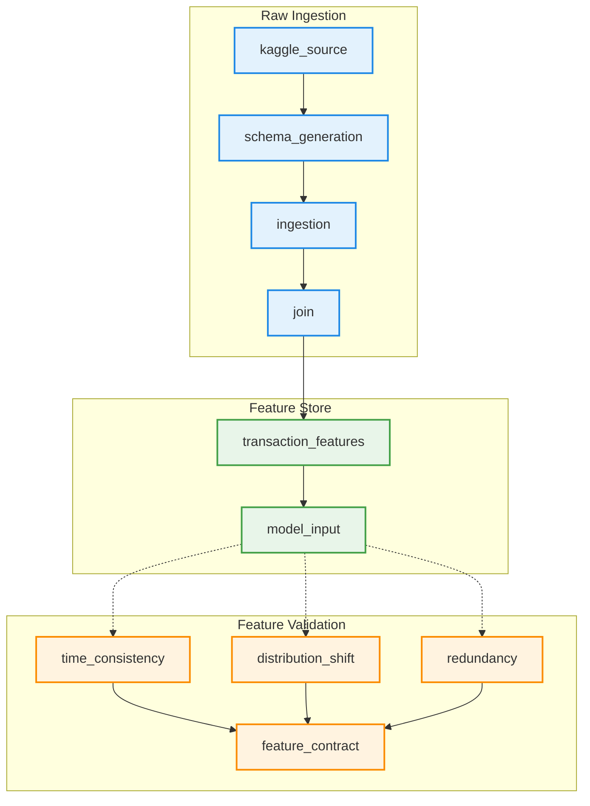
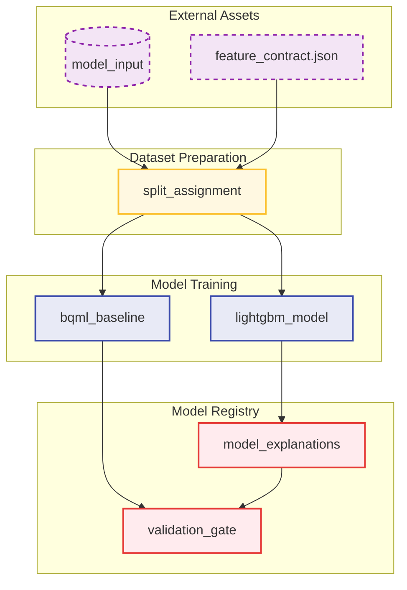

# Dagster Definitions Architecture

This directory contains the two primary code locations (Dagster Definitions) that orchestrate the ML pipeline. The split is deliberate: the **Feature Platform** owns what a feature is and whether it is fit to use, and the **Model Factory** owns what to do with the features that passed.

## Code Location 1: Feature Platform (`feature_platform.py`)

Raw Kaggle CSVs go in, two artifacts come out:

- `features.model_input` — the joined table, one row per transaction, containing every candidate column.
- `references/feature-contract.json` — decides which of those columns a model is allowed to use, and records the verdicts that rejected each of the rest.

Nothing here knows what a model is.

The split between the Feature Store and Feature Validation is worth defending: engineering answers "what could this column be", while the audit answers "should the model be allowed to see it". Collapsing them is how a feature ends up admitted because the person who built it also approved it.

## Code Location 2: Model Factory (`model_factory.py`)

Consumes exactly two artifacts from the feature platform and produces a validated, promotable model.

- `features.model_input` — depended on **by key**, never by value. The assets name the table, because a code location cannot receive another location's return value, only the fact that it materialized.
- `references/feature-contract.json` — read from disk. It decides which columns training is allowed to see. `model_features_admitted_check` asserts after the fit that the model and the contract still agree.

The seam is explicitly declared in `model_factory.py` via `EXTERNAL_ASSETS`. This is the complete list of what the Model Factory does not build for itself. If that list grows, the boundary is moving, and that should be a conscious architectural decision rather than an accident.
