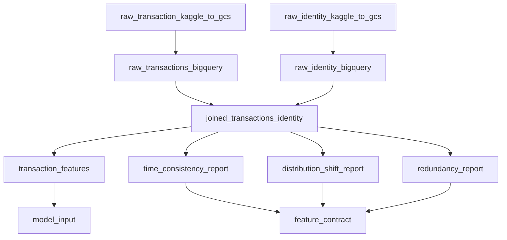

# Dagster code locations

Three `Definitions` objects, loaded as separate processes from `dagster/workspace.yaml`. The
split follows ownership: the feature platform owns what a feature is and whether it is fit to
use, the model factory owns what to do with the features that passed, and inference owns
scoring with whatever was promoted.

The full layout, including groups, checks and automation, is in
[`docs/orchestration.md`](../../../../docs/orchestration.md). This file covers the seams.

## `feature_platform.py`

Raw Kaggle CSVs in, two artefacts out:

- `features.model_input`, the joined table with one row per transaction and every candidate
  column,
- `references/feature-contract.json`, which decides which of those columns a model may use and
  records the verdict that rejected each of the rest.

Nothing here knows what a model is. The separation between building a column and admitting it
is the reason the audits live in their own group: engineering answers what a column could be,
the audit answers whether the model may see it, and collapsing them is how a feature ends up
admitted because the person who built it approved it.

## `model_factory.py`

Consumes exactly two artefacts from the platform and produces a promotable model:
`split_assignment` → `bqml_baseline`, `lightgbm_model` → `model_explanations` →
`validation_gate`.

The seam is declared in `EXTERNAL_ASSETS`:

- `model_input` is depended on **by key**, never by value. A code location cannot receive
  another location's return value, only the fact that it materialized, so the table name comes
  from `core.schema` and both sides read the same constant.
- `feature-contract.json` is read from disk. It decides which columns training may see, and
  `model_features_admitted_check` asserts after the fit that model and contract still agree.

`EXTERNAL_ASSETS` is the complete list of what the model factory does not build for itself. If
it grows, the boundary is moving, and [`tests/test_code_locations.py`](../../../../tests/test_code_locations.py)
fails until somebody decides that on purpose.

## `inference.py`

`best_model` reads the promotion marker; `kaggle_test_joined` → `scoring_history` →
`kaggle_test_model_input` → `kaggle_submission` builds the scoring input over train ∪ test and
writes the submission and the prediction logs. It declares `model_input` and `validation_gate`
as external assets: the first to reconstruct the training categories, the second so that a
promotion is what triggers scoring.
